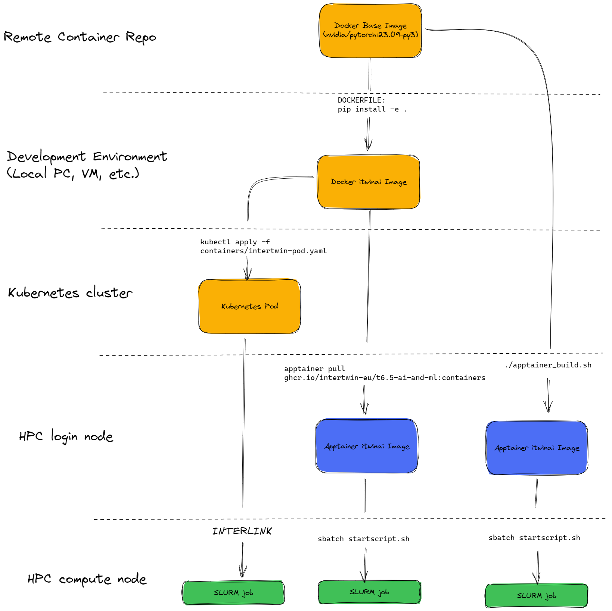

# PoC for AI-centric digital twin workflows

[](https://github.com/marketplace/actions/super-linter)
[](https://github.com/marketplace/actions/markdown-link-check)

See the latest version of our [docs](https://intertwin-eu.github.io/T6.5-AI-and-ML/)
for a quick overview of this platform for advanced AI/ML workflows in digital twin applications.

If you want to integrate a new use case, you can follow this
[step-by-step guide](https://intertwin-eu.github.io/T6.5-AI-and-ML/docs/How-to-use-this-software.html).

In order to use the itwinai module a proper software environment needs to be set up. Currently there are two suggested ways using:
1. Containers
2. Virtual Environments

## Containers

### Requirements

The containers were build using Apptainer version 1.1.8-1.el8 and podman version 4.4.1.

### Base Container

The container are built on top of the [NVIDIA PyTorch NGC Containers](https://catalog.ngc.nvidia.com/orgs/nvidia/containers/pytorch). The NGC containers come with preinstalled libraries such as CUDA, cuDNN, NCCL, PyTorch, etc that are all harmouniously compatible with each other in order to reduce depenency issue and provide a maximum of portability. The current version used is ```nvcr.io/nvidia/pytorch:23.09-py3```, which is based on CUDA 12.2.1 and PyTorch 2.1.0a0+32f93b1.
If you need other specs you can consults the [Release Notes](https://docs.nvidia.com/deeplearning/frameworks/pytorch-release-notes/index.html) and find the right base container for you.


### Running the itwinai container

There are currently three ways to execute the itwinai container on a SLURM cluster.

1. Direct build on the HPC system
2. Use build on the [itwinai repository](https://github.com/interTwin-eu/itwinai/pkgs/container/t6.5-ai-and-ml) and pull to HPC system
3. Deploy to Kubernetes cluster and offload to HPC via [interLink](https://github.com/interTwin-eu/interLink)

 

#### Direct build
Run the following commands to build the container directly on the HPC system. Select the right base container by altering the following line 
```
apptainer pull itwinai.sif docker://nvcr.io/nvidia/pytorch:23.09-py3
```
inside ```containers/apptainer/apptainer_build.sh``` to change to the desired version.

Install the itwinai libraries by running:
```
./containers/apptainer/apptainer_build.sh
```

Run the startscript with 
```
sbatch use-cases/mnist/torch/startscript.sh
```

#### GitHub container repository build
With this method you can just pull the ready container from the GitHub container repository:
```
apptainer pull containers/apptainer/itwinai.sif docker://ghcr.io/intertwin-eu/t6.5-ai-and-ml:containers
```

Run the startscript with 
```
sbatch use-cases/mnist/torch/startscript.sh
```

#### InterLink
To be tested


### Future work
It is currently foreseen to build the container via GH actions.


## Virtual Environments
We suggest to manage Conda environments the use of micromamba, a light weight version of conda.

It is suggested to refer to the
[Manual installation guide](https://mamba.readthedocs.io/en/latest/micromamba-installation.html#umamba-install).

Consider that Micromamba can eat a lot of space when building environments because packages are cached on
the local filesystem after being downloaded. To clear cache you can use `micromamba clean -a`.
Micromamba data are kept under the `$HOME` location. However, in some systems, `$HOME` has a limited storage
space and it would be cleverer to install Micromamba in another location with more storage space.
Thus by changing the `$MAMBA_ROOT_PREFIX` variable. See a complete installation example for Linux below, where the
default `$MAMBA_ROOT_PREFIX` is overridden:

```bash
cd $HOME

# Download micromamba (This command is for Linux Intel (x86_64) systems. Find the right one for your system!)
curl -Ls https://micro.mamba.pm/api/micromamba/linux-64/latest | tar -xvj bin/micromamba

# Install micromamba in a custom directory
MAMBA_ROOT_PREFIX='my-mamba-root'
./bin/micromamba shell init $MAMBA_ROOT_PREFIX

# To invoke micromamba from Makefile, you need to add explicitly to $PATH
echo 'PATH="$(dirname $MAMBA_EXE):$PATH"' >> ~/.bashrc
```

**Reference**: [Micromamba installation guide](https://mamba.readthedocs.io/en/latest/installation.html#micromamba).


### Environment setup

Requirements:

- Linux environment. Windows and macOS were never tested.
- Micromamba: see the installation instructions above.
- VS Code, for development.

#### TensorFlow

Installation:

```bash
# Install TensorFlow 2.13
make tf-2.13

# Activate env
micromamba activate ./.venv-tf
```

Other TF versions are available, using the following targets `tf-2.10`, and `tf-2.11`.

#### PyTorch (+ Lightning)

Installation:

```bash
# Install PyTorch + lightning
make torch-gpu

# Activate env
micromamba activate ./.venv-pytorch
```

Other also CPU-only version is available at the target `torch-cpu`.

#### Development environment

This is for developers only. To have it, update the installed `itwinai` package
adding the `dev` extra:

```bash
pip install -e .[dev]
```

##### Test with `pytest`

To run tests on itwinai package:

```bash
# Activate env
micromamba activate ./.venv-pytorch # or ./.venv-tf

pytest -v -m "not slurm" tests/ 
```

However, some tests are intended to be executed only on an HPC system,
where SLURM is available. They are marked with "slurm" tag. To run also
those tests, use the dedicated job script:

```bash
sbatch tests/slurm_tests_startscript

# Upon completion, check the output:
cat job.err
cat job.out
```

## Documentation folder

Documentation for this repository is maintained under `./docs` location.
If you are using code from a previous release, you can build the docs webpage
locally using [these instructions](docs/README#building-and-previewing-your-site-locally).
