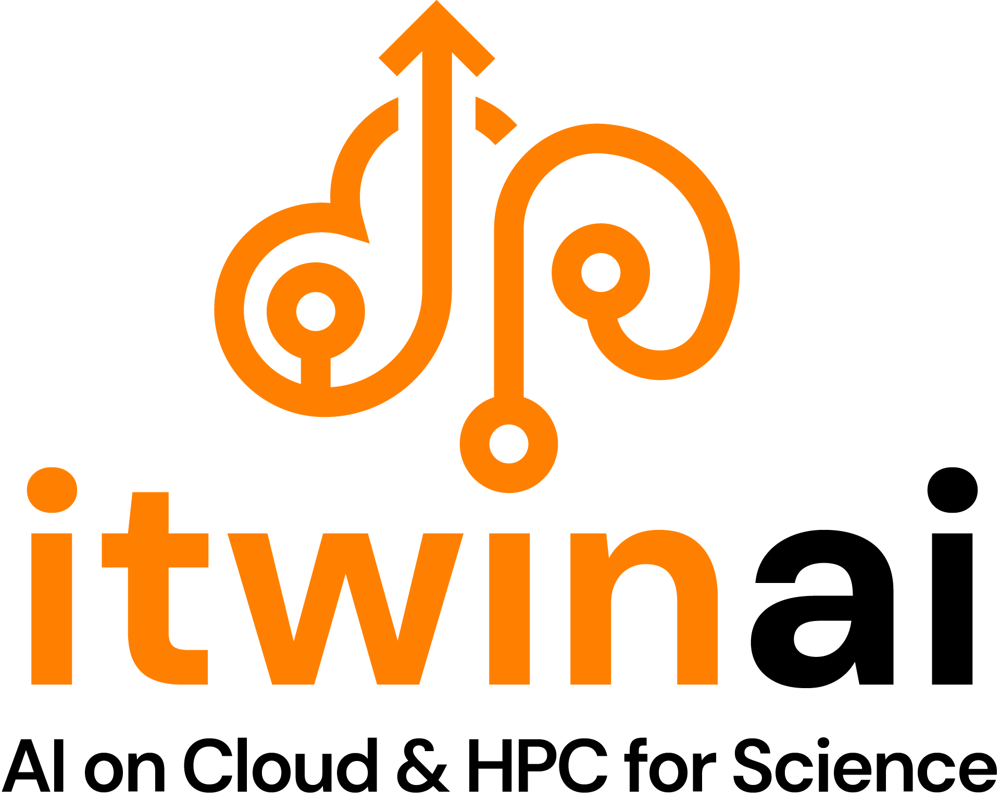

<!-- markdownlint-disable MD041 -->

<!-- markdownlint-disable MD033 -->
<picture>
  <source media="(prefers-color-scheme: dark)" srcset="./docs/images/icon-itwinai-orange-white-subtitle.png">
  
</picture>
<!-- markdownlint-enable MD033 -->

`itwinai` is a Python toolkit designed to help scientists and researchers streamline AI and machine learning
workflows, specifically for digital twin applications. It provides easy-to-use tools for distributed training,
hyper-parameter optimization on HPC systems, and integrated ML logging, reducing engineering overhead and accelerating
research. Developed primarily by CERN, in collaboration with Forschungszentrum Jülich (FZJ), `itwinai` supports modular
and reusable ML workflows, with the flexibility to be extended through third-party plugins, empowering AI-driven scientific
research in digital twins.

See the latest version of our docs [here](https://itwinai.readthedocs.io/).

## Installation

For instructions on how to install `itwinai`, please refer to the
[user installation guide](https://itwinai.readthedocs.io/latest/installation/user_installation.html)
or the
[developer installation guide](https://itwinai.readthedocs.io/latest/installation/developer_installation.html),
depending on whether you are a user or developer

For information about how to use containers or how to test with pytest, you can look
at the following documents:

- [Working with containers](/docs/working-with-containers.md)
- [Testing with pytest](/docs/testing-with-pytest.md)
