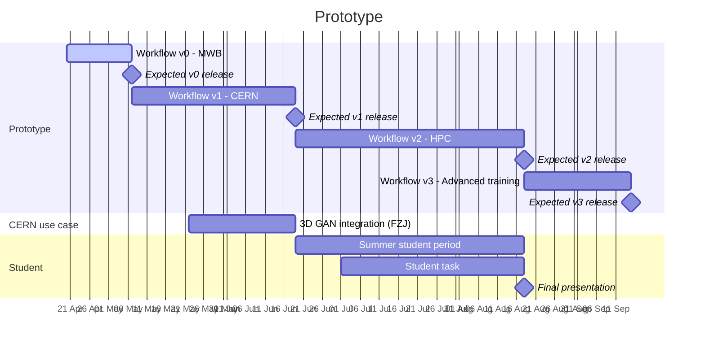
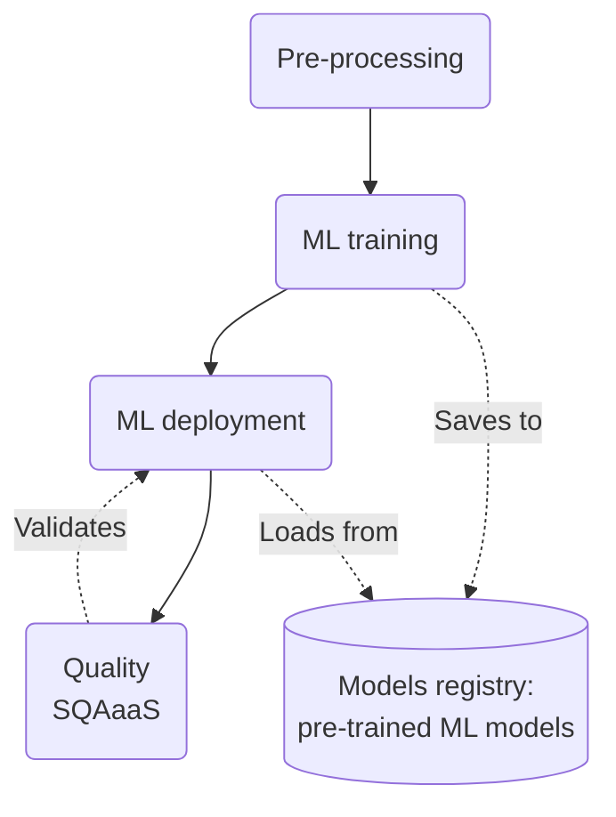

## TL;DR 🏷️

Planning for interTwin AI workflows prototype. Simulate whole AI-centric digital twin workflows, with a special
attention to the AI component. The other steps in the workflows are simulated or simplified.

**Goal**: learn by doing (HPC, MLOps), show that steps of a main DT workflows can be containerized.

**Deadlines**:

- Workflow v0: 7 May
- Workflow v1: 19 Jun
- Workflow v2: 18 Aug
- Workflow v3: 15 Sep (TBD)

## News 🔊

Last update - 21 Apr:

- Updated work plan: Gantt, activities and features of the prototype.

## Milestones 🚩

CP: core prototype
UC: use case integration
HPC: extend to Juelich or other HPC providers

### 🏆Workflow v0 - Minimal working baseline (MWB)

- [x] Split tasks with Alex
- [x] \[CP\] Decompose DT workflow into its fundamental steps: pre-processing and AI blocks
- [ ] \[CP\] New features for AI module: [`itwinai v0.0`](AI-module#itwinai-v00---minimal-working-baseline-mwb)
- [ ] \[CP\] New features for AI module: [`itwinai v0.1`](AI-module#itwinai-v01---consolidated-ai-training)
- [ ] \[CP\]  [CWL](https://www.commonwl.org/) workflow composition and engine
- [ ] \[BP/UC\] Support YAML configuration files
- [ ] \[UC\] MNIST: image classification
- [ ] \[CP\] PyTorch support
- [ ] \[HPC\] Deploy and adapt to FZJ

### 🏆Workflow v1 - Validate on CERN use case

- [ ] \[CP\] New features for AI module: [`itwinai v0.2`](AI-module#itwinai-v02---import-custom-functionalities)
- [ ] \[UC\] Integration of CERN use case (TensorFlow) reusing Kalliopi's progress on FZJ.
- [ ] \[HPC\] deploy and adapt to FZJ

### 🏆Workflow v2 - Scale to HPC

- [ ] \[CP\] New features for AI module: [`itwinai v0.3`](AI-module#itwinai-v03---hpc-support)
- [ ] Deploy workflow steps as containers
- [ ] Integration with workflow engine (e.g., Airflow)
- [ ] \[UC\] Integrate VIRGO, if available
- [ ] \[UC\] Integrate EO use case (one of the following):
  - [ ] Ask interTwin (e.g., Charis)
  - [ ] CMCC
  - [ ] EMPP (Ilaria)
- [ ] \[UC\] The summer student will integrate an use case
- [ ] \[HPC\] deploy and adapt to FZJ

### 🏆Workflow v3 - Advanced AI training

- [ ] \[CP\] New features for AI module: [`itwinai v0.4`](AI-module#itwinai-v04---tune)
- [ ] \[CP\] **Buffer**: uncompleted tasks (from previous milestones).
- [ ] \[UC\] **Buffer**: uncompleted use case integrations (from previous milestones).
- [ ] \[HPC\] deploy and adapt to FZJ

To be allocated:

- [ ] \[CP\] Simple container for each step
- [ ] \[CP\] Online ML (e.g., training)
- [ ]  Get access to K8s at CERN
- [ ] \[CP\] Introduce K8s APIs
- [ ] \[CP\] SQAaaS
- [ ] \[CP\] Advanced ML validation tools (e.g., [Deep Checks](https://deepchecks.com/))
- [ ] \[CP\] Deployment of pre-trained ML model
- [ ] \[CP\] New features for AI module: [`itwinai v0.5`](AI-module#itwinai-v05---kubernetes)

## Notes 📝

Emulate DT workflows in an e2e manner. Validate Ai workflows component by iteratively integrating interTwin use cases.

Split the DT workflow in two main steps: prep-processing and ML training. Optionally, we are going to integrate
quality/validation capabilities provided by SQAaaS. ML deployment is going to be included in the future.

- Solid arrows: workflow direction
- Dashed arrows: interactions

### Use cases

- Toy use case: MNIST images classification
- Simplified CERN use case (3D GAN)
- EO:
  - CMCC
  - interTwin: ask EODC, EURAC (Michele Claus), Charis (WP7/4 leader)
- Data streaming / online ML: Virgo

### Analysis of ML training workflow

A training workflow is a composition of *parametrized* transformations applied to some input data $X_i$. For instance:

- Pre-processing: $f(\,\cdot\,;\gamma_i)$
- ML training: $g(\,\cdot\,;\theta_i)$ ($\theta_i$ are the hyperparams, or hyperparams ranges)
- Quality and validation: $h(\,\cdot\,;\phi_i)$

When data $X_i$ is fixed, we tune the parameters to improve some "goodness" metrics. Differently from standard
workflows, ML training has some features which make it nontrivial to express using DAG notation:

- has loops
- has human in the loop

Conversely, the deployment requires no tuning, thus it is more streamlined:

