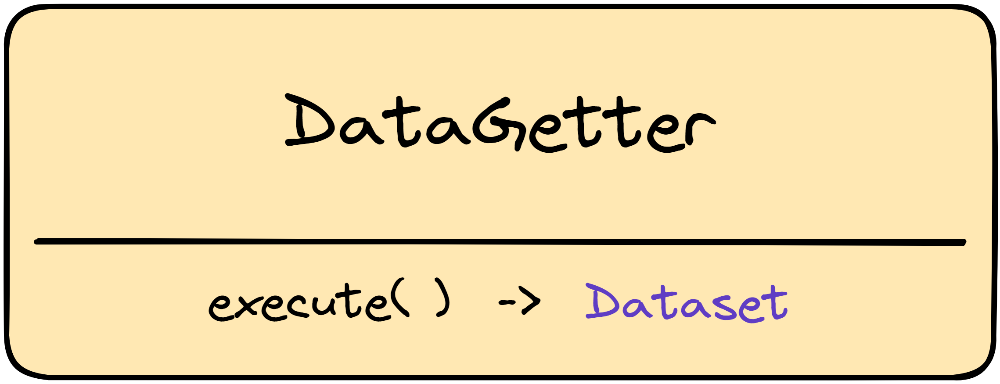
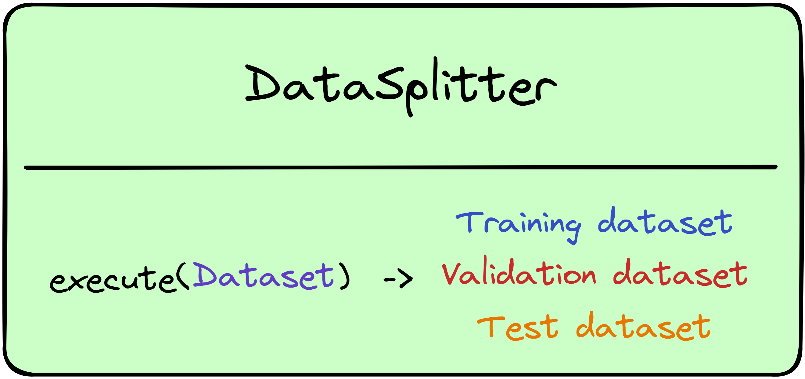
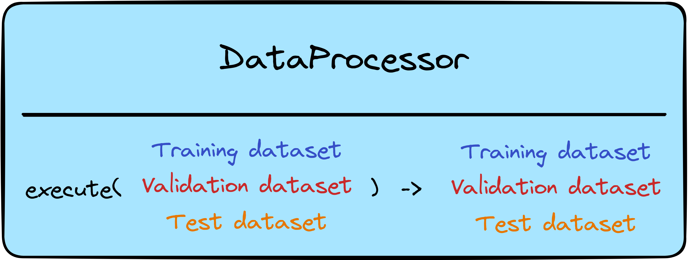
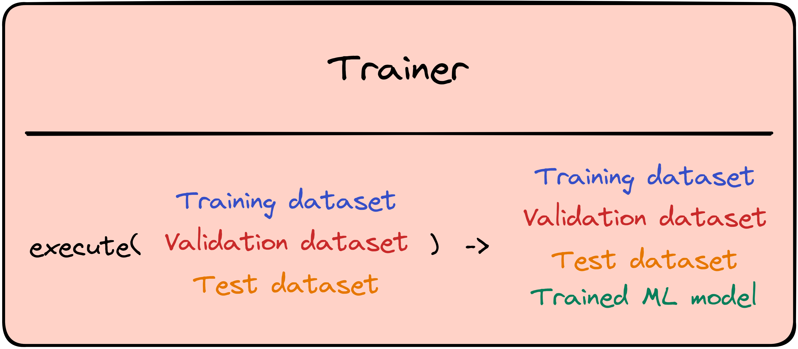
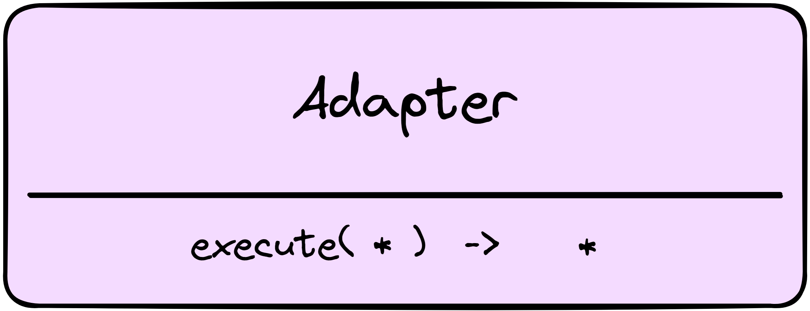
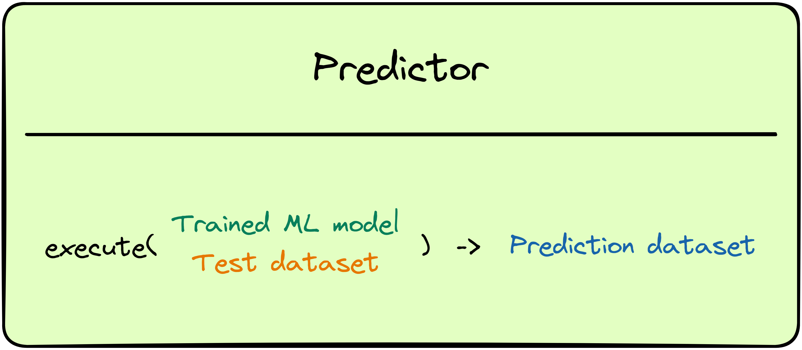

Workflows
====================

Pipeline:
------------------

For simple workflows, itwinai defines a `Pipeline`, defined as an array or dictionary of ordered components.
Much like a python notebook, the Pipeline sequentially runs through the user-defined components inside of it, ensuring code legibility and organisation.
The pipeline execution also avoids I/O overheads typical of serialization of intermediate results to storage when moving to the next component, ensuring efficient workflows
The pipeline structure handles component connection by passing preceding components' output into following components' input whilst staying in-memory, similarly to scikit-learn.

This also implies that the Pipeline structure only handles sequential workflows; more advanced (Directed Acyclic Graphs or DAG) can be implemented with alternative methods as explained in the section :ref:`advanced_workflows`.

A  `Pipeline` can be directly defined in Python code but can also be fully represented in a  **configuration file**. 
The configuration file contains all the parameters and structure variables to uniquely identify any Pipeline and is saved as a .yaml file.
This files contains all the parameters and structure variables required to uniquely identify a `Pipeline`.

Crucially, the input(s) for a component must be appropriate for that component.
Pipeline execution occurs in the order defined by the user. 
Thus, the output of a component must be suitable for the input of the following component.
The Adapter component can be used to ensure this. 
It takes any number of inputs and will output some or all of those inputs in a user-specified order.

Below is given an overview of each component:

Components:
------------------
Components are defined as discrete steps in a `Pipeline` and implemented as Python classes.
For each pipeline component, an `execute()` function is defined that provides a unified interface with every component as well as the whole pipeline.

Datagetter
^^^^^^^^^^^^^^
This component gets or loads the data from a given source and passes it on to the next component.
Its `execute()` function therefore takes no input and passes on the dataset as a single output.
The dataset source can be ...
This component sits at the start of the Pipeline and is usually followed by a `split` component.
(?) Where can the data be loaded from? 
(?) Format limits?
(?)

Datasplitter
^^^^^^^^^^^^^
The `split` component splits a given dataset into three outputs following a user-defined split ratio.
These three outputs will be passed on and used as train, validation, and test sets.

Dataprocessor
^^^^^^^^^^^^^^^^
The **Dataproc**  component is used for data preprocessing.

It is worth noting that data preprocessing before the `split` component is not feasible with this component as it assumes the data to already be split into train, test, and validation sets.
This assumption is made to avoid the introduction of bias or skew in the data.

TRAIN
^^^^^^^^^^^^^^^^
The Datrainer component covers the actual model training. 
Taking train, test, and validation datasets as inputs, the Datatrainer returns 

ADAPT
^^^^^^^^^^^^^^

PREDICT
^^^^^^^^^^^^

.. note::
    The `Pipeline` structure does not handle improper inputs for its components! 
    Each component expects predefined inputs which should be taken into account when constructing your Pipeline.
    The `Adapt` component can be used to ensure components receive the correct input if the preceding component's output is unsuited.
    For example, `Split` returns three data arrays whereas `Save` only takes one input argument.
    To save after a split, `Adapt` can be used to select the element to be saved.

Simple Pipeline Example
^^^^^^^^^^^^^^^^^^^^^^^^

.. image:: figures/simple_pipeline.png
    :alt: Diagram of a simple pipeline structure
    :align: center

Example notebook
===================

.. toctree::
    :hidden:
    :maxdepth: 2
    :caption: Contents

    notebooks/example
    basic_workflow_notebook