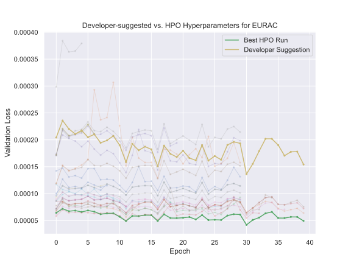

.. _explain_hpo:

Hyperparameter Optimization
===========================

**Author(s)**: Anna Lappe (CERN), Matteo Bunino (CERN)

Hyperparameter optimization (HPO) is a core technique for improving machine learning model
performance. This page introduces the concepts behind HPO, covering key elements like
hyperparameters, search algorithms, schedulers, and more. It also outlines the benefits and
drawbacks of HPO, helping you make informed decisions when applying it with itwinai. 

Key Concepts
------------

**Hyperparameters** are parameters in a machine learning model or training process that are set
before training begins. They are not learned from the data but can have a significant impact on
the model's performance and training efficiency. Examples of hyperparameters include:

*    Learning rate
*    Batch size
*    Number of layers in a neural network
*    Regularization coefficients (e.g., L2 penalty)

HPO is the process of systematically searching for the optimal set of hyperparameters to
maximize model performance on a given task.

The **search space** defines the range of values each hyperparameter can take. It may include
discrete values (e.g., [32, 64, 128]) or continuous ranges (e.g., learning rate from 1e-5 to
1e-1).

**Search algorithms** explore the hyperparameter search space to identify the best
configuration. Common approaches include:

*    Grid Search: Exhaustive search over all combinations of hyperparameter values.
*    Random Search: Randomly samples combinations from the search space.
*    Bayesian Optimization: Uses a probabilistic surrogate model to learn the shape of the
     search space and predict promising configurations.
*    Evolutionary Algorithms: Use search algorithms based on evolutionary concepts to evolve
     hyperparameter configurations, e.g. genetic programming.

**Schedulers** manage the allocation of computational resources across multiple hyperparameter
configurations. They help prioritize promising configurations and terminate less effective ones
early to save resources. Examples include:

*    ASHA (Asynchronous Successive Halving Algorithm): Allocates resources by successively
     discarding the lowest-performing hyperparameter combinations.
*    Median Stopping Rule: Stops trials that perform below the median of completed trials.

The **evaluation metric** determines the performance of a model on a validation set. Common
metrics include accuracy, F1 score, and mean squared error. The choice of metric depends on the
task and its goals.

A **trial** is the evaluation of one set of hyperparameters. Depending on whether you are using
a scheduler, this could be the entire training run, so as many epochs as you have specified, or
it could be terminated early and thus run for fewer epochs.

Example of HPO on the EURAC use case
------------------------------------

The following is an example of HPO on the EURAC use case. We asked a domain expert to

1. suggest their best guess for high-performing hyperparameters
2. suggest an appropriate hyperparameter search space for HPO

We then ran the parameters that the developer thought would perform best as an isolated trial
and performed HPO using random search, running 28 trials of 40 epochs each within the suggested
search space. You can see the resulting validation losses in the following plot:

As we can see, the best HPO run is considerably better, achieving a validation loss three times
lower than the developer's suggested parameters. This shows that even a domain expert may miss
substantial performance gains by not utilizing HPO. 

When to Use HPO and Key Considerations
--------------------------------------

HPO can significantly enhance a model's predictive accuracy and generalization to unseen data
by finding the best hyperparameter settings. However, there are some drawbacks, especially with
regards to computational cost and resource management. Especially distributed HPO requires
careful planning of computational resources to avoid bottlenecks or excessive costs. You should
consider that if you want to run four different trials, and you run them on the same amount of
resources as you normally would, your training would run four times as long.

Because of this, we want to design our HPO training wisely, so that we avoid unneseccary
computational cost. These are some things that might help you when you are getting started with
HPO.

HPO is beneficial when:

*    model performance is sensitive to hyperparameter settings.
*    you have access to sufficient computational resources.
*    good hyperparameter settings are difficult to determine manually.

To make sure you get the most out of your HPO training, the are some considerations you might
want to make are to

*    define the search space wisely: Narrow the search space to plausible ranges to improve
     efficiency.
*    choose appropriate metrics: Use metrics aligned with your task's goals. With some search
     algorithms it is also possible to do multi-objective optimization, e.g. if you want to
     track both accuracy and L1 loss - just make sure that the metric that you track conforms
     with your search algorithm.
*    allocate your resources strategically: Balance the computational cost with the expected
     performance gains. This is what the scheduler is for, and it is generally always a good
     idea to use one, unless you expect your objective function to be extremely heterogenous,
     i.e. that the performance of a hyperparameter configuration on the first (for example) ten
     epochs is not a good indicator for its future performance at all. You might also have
     experience in training your model and want to account for additional behaviors -- for this
     there are additional parameters you may set, such as a grace period (a minimum number of
     iterations a configuration is allowed to run).

Hyperparameter Optimization in itwinai
--------------------------------------

Now that we know the key concepts behind HPO, we can explore how these are implemented in
itwinai. The itwinai :class:`~itwinai.torch.trainer.TorchTrainer` has HPO functionalities
already built-in, which means no extra scripts and you can run it as you normally would in any
itwinai pipeline. In the next section we'll introduce distributed HPO, and discover how we can
easily start optimizing hyperparameters in our exisiting itwinai pipeline with just a few lines
of code. We will then describe the architecture and operation of the
:class:`~itwinai.torch.trainer.TorchTrainer` and talk about what to consider when choosing the
best HPO integration for you.

Ray Overview
^^^^^^^^^^^^

Under the hood, we use an open-source framework called Ray to facilitate distributed HPO. Ray
provides two key components used in itwinai:

*    **Ray Train**: A module for distributed model training.
*    **Ray Tune**: A framework for hyperparameter optimization, supporting a variety of search
     algorithms and schedulers.

Ray uses its own cluster architecture to distribute training and HPO. A ray cluster consists of
a group of nodes that work together to execute distributed tasks. Each node can contribute
computational resources, and Ray schedules and manages these resources.

How a Ray Cluster Operates:

#.    **Node Roles**: A cluster includes a head node (orchestrator) and worker nodes
      (executors). 
#.    **Task Scheduling**: Ray automatically schedules trials across nodes based on available
      resources.
#.    **Shared State**: Nodes share data such as checkpoints and trial results via a central
      storage path.

We launch a ray cluster using a dedicated slurm job script that you can find in related
tutorials. Also refer to the `ray documentation
<https://docs.ray.io/en/latest/cluster/vms/user-guides/community/slurm.html>`_ on this topic,
if you want to learn more about how to launch a ray cluster with slurm.

How to Tune your model with itwinai
^^^^^^^^^^^^^^^^^^^^^^^^^^^^^^^^^^^

The itwinai :class:`~itwinai.torch.trainer.TorchTrainer` combines components from **Ray Train**
and **Ray Tune**, providing
a fully distributed approach to hyperparameter optimization (HPO) and machine learning
training. It enables distributed machine learning within HPO, allowing each independent trial
to run in a distributed manner. This method is ideal for large-scale experiments that require
optimized resource utilization across multiple nodes.  

Key features of the :class:`~itwinai.torch.trainer.TorchTrainer`:  

- **Seamless Integration**: Works with all itwinai components, such as loggers, data getters,
  and splitters.  
- **Flexibility**: Supports various search algorithms and schedulers from Ray Tune.  
- **Minimal Code Changes**: Easily integrates into existing itwinai pipelines with minimal
  modifications.  

.. note::  
   Do **not** wrap the :class:`~itwinai.torch.trainer.TorchTrainer` into Ray's ``Tuner``
   manually, as the trainer already uses the tuner under the hood, and doing so would create
   two tuners.  

For a hands-on tutorial on setting up distributed HPO with itwinai, check out the
:doc:`distributed HPO tutorial <../../tutorials/hpo-workflows/hpo-torchtrainer-integration>`.  

Further References on Hyperparameter Optimization
==================================================

Some of these talks are short; others more in-depth. All are highly recommended:

- `Andrew Ng: Scaling Neural Networks <https://www.youtube.com/watch?v=wKkcBPp3F1Y&t=4s>`__
- `Geoff Hinton: Deep Learning Foundations <https://www.youtube.com/watch?v=i0cKa0di_lo&t=683s>`__
- `Dataroots: AI & Digital Twins Overview <https://www.youtube.com/watch?v=hboCNMhUb4g>`__
- `Paretos: HPO Techniques Explained <https://www.youtube.com/watch?v=M-NTkxfd7-8>`__

Key papers on popular hyperparameter-optimization algorithms (you needn’t read them all immediately, but they’re great to bookmark):

- `Hyperband (Li et al. 2016) <https://arxiv.org/abs/1603.06560>`__
- `ASHA (Li et al. 2018) <https://arxiv.org/abs/1810.05934>`__
- `BOHB (Falkner et al. 2018) <https://arxiv.org/abs/1807.01774>`__
- `GP- and TPE-based Bayesian Optimization <https://proceedings.neurips.cc/paper_files/paper/2011/file/86e8f7ab32cfd12577bc2619bc635690-Paper.pdf>`__

Also, see the Ray Tune key-concepts overview for a concise tour of HPO in Ray:
`Ray Tune Key Concepts <https://docs.ray.io/en/latest/tune/key-concepts.html?_gl=1*1i6k6z8*_ga*ODM5ODM1MjI4LjE3MjY0Nzk2ODQ.*_up*MQ..*_ga_0LCWHW1N3S*MTcyNjQ3OTY4Ny4xLjEuMTcyNjQ3OTY4OS4wLjAuMA>`__.
