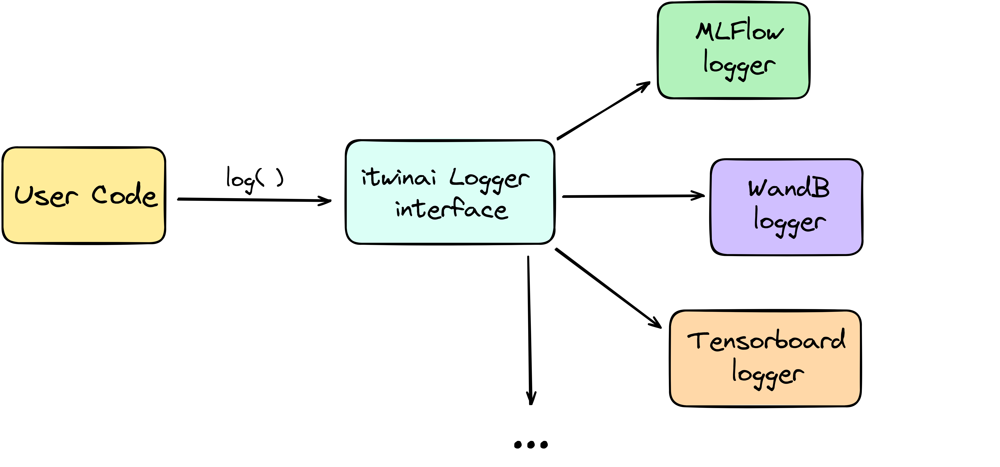

Tracking ML workflows
=========================

**Author(s)**: Matteo Bunino (CERN), Killian Verder (CERN)

One key aspect of understanding the intricacies of your ML experiment lies in
the descriptive data around hyper-parameters, metrics, and model checkpoints.
This information allows us to compare different models and reproduce previous
results.

In order to facilitate this, itwinai provides a :class:`~itwinai.loggers.Logger`
wrapper which provides
users with a simple, unified method to extract descriptive information about
their ML training run regardless of which supported logger is used.

The core idea is to abstract user-developed code from popular logging frameworks
(such as MLFlow, Weights&Biases, Tensorboard), allowing itwinai users to easily
switch between loggers with no changes to their code. Moreover, this abstraction
layer allows the use of multiple logging frameworks at the same time, enabling our
users to pick the best from each one.

The supported loggers, also shown in figure :numref:`logger_abstraction_fig`, are listed in
the :py:mod:`itwinai.loggers` module documentation.

.. _logger_abstraction_fig:

    Informal representation of itwinai logger abstraction.

Getting started with itwinai loggers
-------------------------------------

itwinai provides a wrapper that allows the user to call a logger in a unified
manner regardless of which logger is used on the backend.

The abstraction of logging logic that the itwinai logger provides can avoid redundant
code duplication and simplify the maintenance of large-scale projects.

The itwinai :class:`~itwinai.loggers.Logger` provides a unique interface to log any
*kind* of data trough the :meth:`~itwinai.loggers.LogMixin.log` method. You can use
it to log metrics, model checkpoints, images, text, provenance information, and more.
However, to make sure that the item you want to log is correctly managed, you need
to specify its kind by means of the ``kind`` argument.
See :py:mod:`itwinai.loggers` module documentation for a list of object kinds
that can be logged.

.. admonition:: Example of basic usage of itwinai Logger

    The following outlines how to concretely use the logger on a toy example:

    .. code-block:: python

        from itwinai.loggers import MLFlowLogger

        my_logger = MLFlowLogger(
            experiment_name='my_awesome_experiment',
            log_freq=100
        )

        # Initialize logger
        my_logger.create_logger_context()

        # During PyTorch model training
        for epoch in range(100):
            
            loss_accumulator = .0
            for batch_idx, batch in enumerate(train_dataloader):
                x, y = batch
                pred = my_net(x)
                loss = loss_criterion(y, pred)
                ...
                # Log the loss with "batch" granularity
                my_logger.log(
                    item=loss.item(),
                    identifier='my_training_loss_batch',
                    kind='metric',
                    batch_idx=batch_idx
                )
                loss_accumulator += loss.item()
                ...
            
            epoch_loss = loss_accumulator / len(train_dataloader)
            # Log the loss with "epoch" granularity
            my_logger.log(
                item=epoch_loss,
                identifier='my_training_loss_epoch',
                kind='metric'
            )

        # Save model after training
        my_logger.log(
            item=my_net,
            identifier='trained_model',
            kind='model'
        )

        # Destroy logger before exiting
        my_logger.destroy_logger_context()

Similarly, you can use itwinai loggers in the itwinai :class:`~itwinai.torch.trainer.TorchTrainer`.

.. admonition:: Example of itwinai Logger and TorchTrainer

    .. code-block:: python

        from itwinai.loggers import WandBLogger
        from itwinai.torch.trainer import TorchTrainer

        my_logger = WandBLogger(
            project_name='my_awesome_experiment',
            log_freq=100
        )

        # If needed, override the default trainer
        class MyCustomTrainer(TorchTrainer):
            ...

            def train(self, ...):
                ...
                self.logger.log(
                    item=some_metric,
                    identifier='my_metric_name',
                    kind='metric'
                )

        # Instantiate the trainer passing some itwinai logger
        my_trainer = MyCustomTrainer(
            config=...,
            epochs=100,
            model=my_net,
            strategy='ddp',
            logger=my_logger
        )

        ...

        # Start training
        my_trainer.execute(train_dataset, validation_dataset)

Logging frequency trade-off
+++++++++++++++++++++++++++

Neural networks parameters are iteratively optimized on small data samples
extracted from some training dataset, also called **batches**.
On the other hand, an **epoch** refers to one sweep through the entire dataset,
iterating over all batches that compose it. Thus, an epoch consists of multiple
batch iterations.

Logging ML metadata for each batch of each epoch would provide users with the most
granular information possible, but it comes at a significant cost in training speed due to
the slow process of writing to disk after each batch (a.k.a. I/O bottleneck).
Thus, logging every few batches or only once per epoch can be a worthy trade-off
depending on the use case.

The ``log_freq`` argument in the :class:`~itwinai.loggers.Logger` constructor
allows the user to determine at which batch interval the action of logging is
actually performed, without having to change the training routine.
When an integer is passed as ``log_freq``, the logger will honor the call to the
:meth:`~itwinai.loggers.LogMixin.log` method for each batch, if that batch's
index is a multiple of the given integer (i.e., ``batch_id % log_freq == 0``).
In all the other cases (i.e., ``batch_id % log_freq != 0``), the logger will ignore
the :meth:`~itwinai.loggers.LogMixin.log`
call in a transparent way for the user.

.. admonition:: Example on the functioning of ``log_freq`` constructor argument

    Should ``log_freq = 10``, the first batch (``batch_id = 0``) is logged, after which
    the 11th batch (``batch_id = 10``) is logged, after which the 21th batch is logged
    and so on.

``log_freq`` can also receive the following string values: ``"epoch"`` or ``"batch"``.

- When set to ``"epoch"``, the logger only logs when called outside of the nested
  training loop iterating over dataset batches. In other words, the logger only
  logs if ``batch_idx`` is not passed as parameter to the
  :meth:`~itwinai.loggers.LogMixin.log` method.
- When set to ``"batch"``, every batch is logged.

.. warning::

    The logger assumes to be outside of the inner training loop (namely, the one
    iterating over dataset batches) when the ``batch_idx`` argument of the
    :meth:`~itwinai.loggers.LogMixin.log` method is set to ``None`` or is
    simply not given. **It is therefore your responsibility to make sure that**
    ``batch_idx`` **is always passed to the** :meth:`~itwinai.loggers.LogMixin.log`
    **method when available (i.e., when iterating over batches)!**
    If you don't do it, the logger will always log, regardless of what you pass
    to the ``log_freq`` argument in the :class:`~itwinai.loggers.Logger`
    constructor. In other words, if you do not pass the ``batch_idx`` argument
    to the :meth:`~itwinai.loggers.LogMixin.log` where you should, then you can
    run into the situation where you told the logger to only log on epochs,
    but then it also logs on batches.

Logging during distributed ML
++++++++++++++++++++++++++++++++++

In distributed workflows, multiple workers perform tasks at the same time.
This can sometimes cause problems called race conditions,
where the order in which different workers access or modify the same resource
affects the software's behavior. For example, if every
worker in a distributed ML job tries to log its local copy of a variable,
they might all write to the same file simultaneously,
leading to errors. In other cases, if all workers log identical information
(like model parameters when using data parallelism), it
can result in unnecessary redundancy.

To manage this, each worker in a distributed environment is given a unique
number, called its **global rank**. This is simply an integer
going from :math:`0` to :math:`N - 1`,
where :math:`N` is the total number of workers. A worker's rank can be
accessed from a process using various methods, such
as through environment variables set by the
`torchrun <https://pytorch.org/docs/stable/elastic/run.html>`_ launcher.

The itwinai logger helps control which workers are allowed to log
and, conversely, in which workers calls to the :meth:`~itwinai.loggers.LogMixin.log`
method should be ignored.
Using the ``log_on_workers argument`` argument in the
:class:`~itwinai.loggers.Logger` constructor,
you can specify which worker(s) should log based on their global rank.

To make sure each logger knows its worker's rank, the
:meth:`~itwinai.loggers.Logger.create_logger_context` method accepts a ``rank``
integer.

.. admonition:: Example of itwinai Logger in a distributed ML job

    In this example, we use the itwinai :class:`~itwinai.loggers.MLFlowLogger` to log
    only on the worker with global rank equal to 0. In all the other workers, calls
    to the :meth:`~itwinai.loggers.LogMixin.log` method will be ignored.

    As you can see, the code is very similar to the example above, with the only
    differences being in the logger constructor and the
    :meth:`~itwinai.loggers.Logger.create_logger_context` method.

    When using the itwinai :class:`~itwinai.torch.trainer.TorchTrainer`, the rank will
    be automatically passed
    to the logger's :meth:`~itwinai.loggers.Logger.create_logger_context` method
    by the :class:`~itwinai.torch.trainer.TorchTrainer`.

    .. code-block:: python

        import os
        from itwinai.loggers import MLFlowLogger

        my_logger = MLFlowLogger(
            experiment_name='my_awesome_experiment',
            log_freq=100,
            log_on_workers=0
        )

        # Initialize logger, assuming RANK env variable by torchrun launcher
        my_logger.create_logger_context(rank=int(os.environ['RANK']))

        # During PyTorch model training
        for epoch in range(100):
            
            loss_accumulator = .0
            for batch_idx, batch in enumerate(train_dataloader):
                x, y = batch
                pred = my_net(x)
                loss = loss_criterion(y, pred)
                ...
                # Log the loss with "batch" granularity
                my_logger.log(
                    item=loss.item(),
                    identifier='my_training_loss_batch',
                    kind='metric',
                    batch_idx=batch_idx
                )
                loss_accumulator += loss.item()
                ...
            
            epoch_loss = loss_accumulator / len(train_dataloader)
            # Log the loss with "epoch" granularity
            my_logger.log(
                item=loss.item(),
                identifier='my_training_loss_epoch',
                kind='metric'
            )

        # Save model after training
        my_logger.log(
            item=my_net,
            identifier='trained_model',
            kind='model'
        )

        # Destroy logger before exiting
        my_logger.destroy_logger_context()

.. note::

    When logging on more than one worker using the same logger, **it is responsibility
    of the user to verify
    that the chosen logging framework supports multiprocessing**, adapting it accordingly
    if not.

Pytorch Lightning Logger
+++++++++++++++++++++++++++
In addition to the itwinai loggers, itwinai provides a way for users to integrate itwinai
logging functionalities within PyTorch Lightning workflows. Designed to work as a direct
substitute for the PyTorch Lightning logger, the :class:`~itwinai.loggerstorch..ItwinaiLogger`
wraps any existing itwinai logger (e.g., MLFlow or Prov4ML logger) and adapts it to the 
PyTorch Lightning interface. By implementing the same methods as the PyTorch Lightning logger, 
the :class:`~itwinai.loggerstorch..ItwinaiLogger` allows users to replace the default logger
in their existing code with this wrapper while maintaining compatibility with PyTorch 
Lightning's logging operations, including integration with the ModelCheckpoint callback. 

.. admonition:: Example of Pytorch Lightning Trainer using ItwinaiLogger

    In this example, we see how we can instantiate the 
    :class:`~itwinai.loggerstorch..ItwinaiLogger` with an itwinai logger instance of our choice
    and pass it to a Pytorch Lightning Trainer to use just as any other Lightning Logger.

    .. code-block:: python

        import pytorch_lightning as pl
        from my_models import MyModel
        from itwinai.loggers import Prov4ML
        from itwinai.torch.loggers import ItwinaiLogger
        
        my_model = MyModel()

        my_prov_logger = Prov4ML()
        my_lightning_logger = ItwinaiLogger(itwinai_logger=my_prov_logger)
        
        trainer = pl.Trainer(logger=my_itwinai_logger)
        trainer.fit(model)

This illustrates the basic structure of instantiating the
:class:`~itwinai.loggerstorch..ItwinaiLogger` and passing it to a
Pytorch Lightning trainer instance. 
A more detailed example of the use of the :class:`~itwinai.loggerstorch..ItwinaiLogger`
in an itwinai Pytorch Lightning training pipeline on the MNIST dataset can be found in 
:doc:`Pytorch Lightning <../../use-cases/mnist_doc>`

Further references
-------------------

- :py:mod:`itwinai.loggers` module documentation.
- `MLFlow <https://mlflow.org/docs/latest/tracking/tracking-api.html#manual-logging>`_:
  An open-source logger, MLFlow integrates with most commonly used ML libraries. MLFlow
  offers tools such as a model registry to aid in version tracking, facilitation of model
  deployment through MLFlow Models, and strong integration with commonly used ML frameworks.
- `Weights&Biases <https://docs.wandb.ai/ref/python/watch>`_: Besides comprehensive
  tracking of hyperparameters, model metrics, and system
  performance measures, WandB offers an interactive web-based dashboard that
  visualises logged metrics in real time.
- `Tensorboard for TensorFlow <https://tensorflow.org/tensorboard>`_: Tensorboard
  offers a comprehensive suite of visualisation tools including real-time plotting,
  graph visualisation of neural networks, and image and audio logging besides scalar
  outputs.
- `Tensorboard for PyTorch <https://lightning.ai/docs/pytorch/stable/api/lightning.pytorch.loggers.tensorboard.html>`_
  Similarly as for TensorFlow, you can use this variant of TensorBoard when
  training PyTorch models. 
