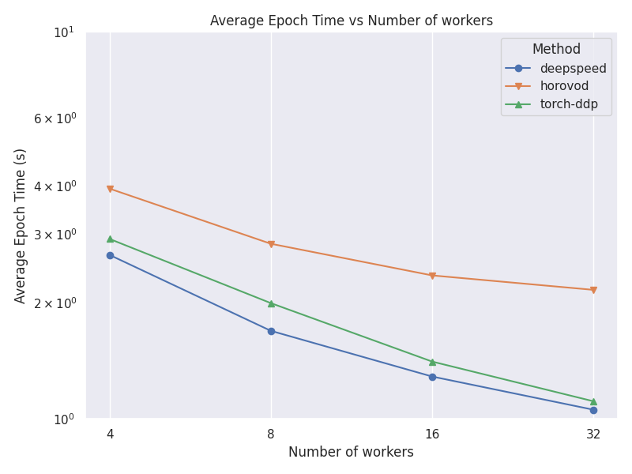
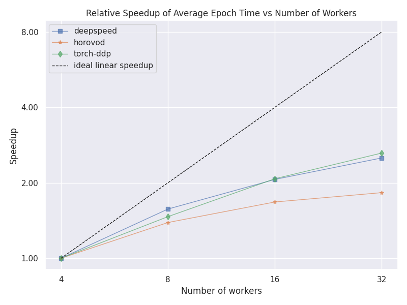
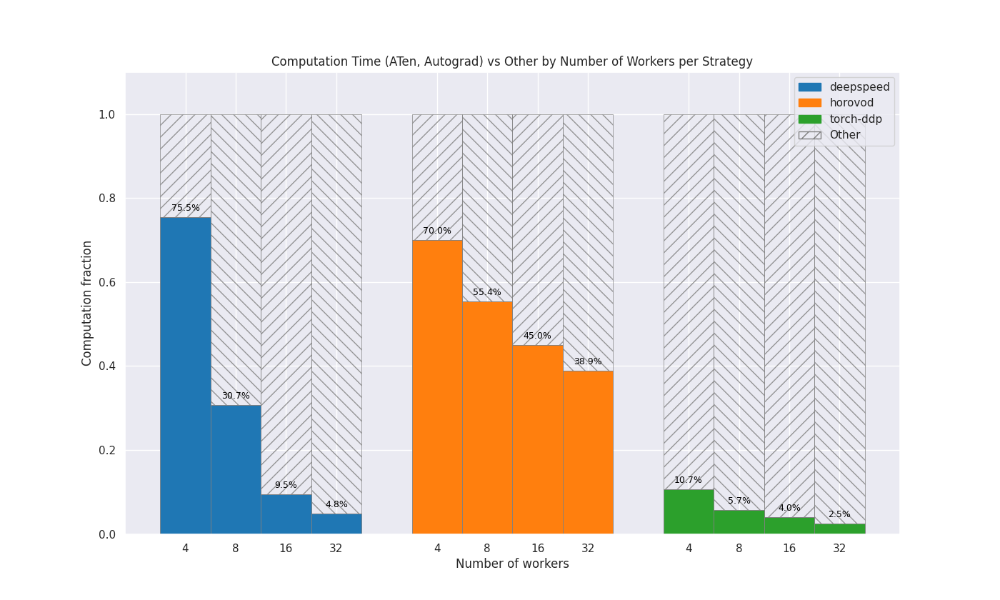

Scalability Report
==================

The ``itwinai`` Scalability Report provides insights into how well your model's
performance scales when training across multiple GPUs and nodes. It can be used to find
bottlenecks or bugs as you distribute your workload, as well as help you monitor your
model's sustainability. The main goals are as follows:

- Understand how well your model scales with regards to the given metrics
- Discover which distribution strategy works best for your pipeline

The Scalability Report includes the following metrics: 

- Average time per epoch
- Relative speedup of time per epoch
- GPU Utilization (0-100%)
- GPU Power Consumption (watt-hours)
- Computation vs. other

For more information about profiling with ``itwinai``, you can have a look at the
:doc:`profiling overview <../../tutorials/profiling/profiling-overview>`.

.. note:: 

   To use the Scalability Report functionality of ``itwinai``, you need to use a
   Trainer object that inherits the ``itwinai`` ``TorchTrainer``. 

Generating the Data
-------------------

To generate the data, you have to train a model with the various profilers enabled,
which can be toggled using the following flags in your training configuration:

.. code-block:: yaml

   steps:
    - ...
    - _target_: <your-trainer-class>
      measure_gpu_data: True  # Measures GPU utilization and power consumption
      enable_torch_profiling: True  # Enable profiling for comparing comm. time vs. other
      store_torch_profiling_traces: True # Store the traces from the profiling (requires setting enable_torch_profiler to True)
      measure_epoch_time: True  # Measures avg. epoch time and rel. speedup
      ...

The epoch time is measured using the `EpochTimeTracker`, while the remaining metrics
are measured using the following decorators:

- **PyTorch Profiler**: This profiler measures the time spent in computation vs. other in your
  distributed machine learning. This is done by comparing the time spent in PyTorch's ATen
  library with the rest of the time. It uses the PyTorch Profiler to retrieve this
  information and is enabled using the ``enable_torch_profiling`` flag.
- **GPU Data Profiler**: This profiler measures the GPU utilization and the total power
  consumption of the training. This is done by probing the GPU at a pre-defined interval
  and retrieving the needed data. The data from the GPU data profiler is saved to MLFlow and
  therefore not a part of the `generate-scalability-report` command.

If you overwrite the ``TorchTrainer``'s ``train()`` method, then the decorators need to
be placed above your overwritten ``train()`` method as in the following example:

.. code-block:: python
   
  from itwinai.torch.monitoring.monitoring import measure_gpu_utilization
  from itwinai.torch.profiling.profiler import profile_torch_trainer

  class MyTrainer(TorchTrainer):
     ...

     @profile_torch_trainer
     @measure_gpu_utilization
     def train(self, ...):
        # Your train method here

If your profilers are enabled in the configuration—and if applicable, your decorators have
been appropriately positioned above your ``train()`` method—then this will create a
directory named ``scalability-metrics`` in the current working directory, under which
three subdirectories will be created: 

- ``epoch-time``: The wall-clock time data from the ``EpochTimeTracker``
- ``computation-data``: The computation overhead data

The GPU data will be written to MLFlow. 

Generating the Report
---------------------

You can generate the report using the following command: 

.. code-block:: bash

   itwinai generate-scalability-report

This command takes in some extra arguments that can be viewed with the ``--help`` flag:

.. code-block:: bash

   itwinai generate-scalability-report --help

When running this command by default, it will look in your ``scalability-metrics``
directory and look for the subdirectories listed above. Only the reports relevant to
the subdirectories that are present will be created, while missing subdirectories will only
result in a warning.

Example Results
---------------

The following will show some example results from the MNIST plugin for ``itwinai``. The
experiment was repeated three times to reduce random noise. Notice how the code seems to
scale poorly, which is expected since the dataset is so small. Thus, the overhead of
distributing it to multiple nodes ends up comprising a significant portion of the final
training time.

The report results in a table of scalability results—printed in the console—as
well as plots showing the same results visually. An example of the resulting console
output can be seen here.

.. code-block::

  ######## Epoch Time Report ########
       name  workers avg_epoch_time
  deepspeed        4         2.65 s
  deepspeed        8         1.69 s
  deepspeed       16         1.29 s
  deepspeed       32         1.06 s
    horovod        4         3.94 s
    horovod        8         2.83 s
    horovod       16         2.35 s
    horovod       32         2.15 s
  torch-ddp        4         2.92 s
  torch-ddp        8         1.99 s
  torch-ddp       16         1.41 s
  torch-ddp       32         1.11 s

  No GPU Data Found

  ######## Computation Data Report ########
  num_gpus  strategy computation_fraction
         4 deepspeed              75.47 %
         4   horovod              70.05 %
         4 torch-ddp              10.67 %
         8 deepspeed              30.66 %
         8   horovod              55.40 %
         8 torch-ddp               5.67 %
        16 deepspeed               9.52 %
        16   horovod              45.05 %
        16 torch-ddp               3.96 %
        32 deepspeed               4.80 %
        32   horovod              38.94 %
        32 torch-ddp               2.49 %

In this case, data was collected for 4, 8, 16 and 32 GPUs for the ``DeepSpeed``, ``Horovod``
and ``PyTorch DDP`` strategies. The associated plots can be seen below: 

Average Epoch Time Comparison
~~~~~~~~~~~~~~~~~~~~~~~~~~~~~
This plot shows a comparison between the average time per epochs for each strategy and number
of nodes. 

Relative Epoch Time Speedup
~~~~~~~~~~~~~~~~~~~~~~~~~~~
This plot shows a comparison between the speedup between the different number of nodes
for each strategy. The speedup is calculated using the lowest number of nodes as
a baseline.

Computation vs other
~~~~~~~~~~~~~~~~~~~~~~~~~~~~
This plot shows how much of the GPU time is spent doing computation compared to other
operations, for each strategy and number of nodes. The colored area represents computation and
the shaded area represents other operations, e.g. communication. For each strategy, the
columns are normalized to be between 0.0 and 1.0. 

