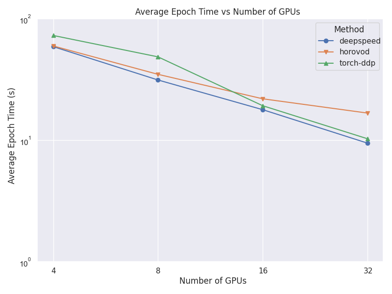
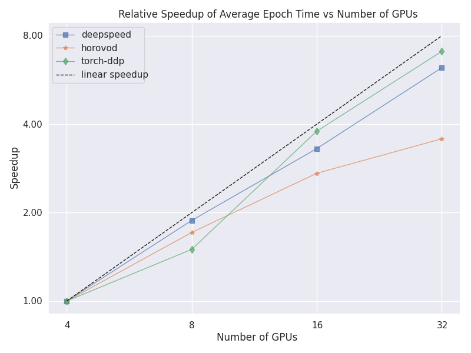
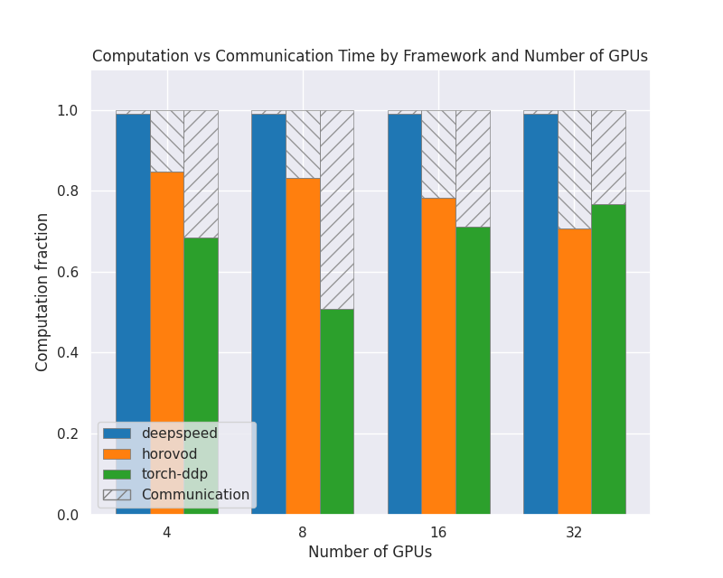
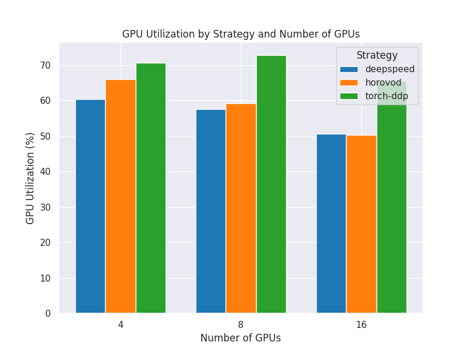
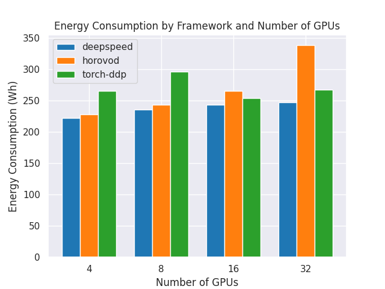

Scalability Report
==================

The ``itwinai`` Scalability Report provides insights into how well your model's
performance scales when training across multiple GPUs and nodes. It can be used to find
bottlenecks or bugs as you distribute your workload, as well as help you monitor your
model's sustainability. The main goals are as follows:

- Understand how well your model scales with regards to the given metrics
- Discover which distributed strategy works best for your pipeline

The Scalability Report includes the following metrics: 

- Average time per epoch
- Relative speedup of time per epoch
- GPU Utilization (0-100%)
- GPU Power Consumption (watt-hours)
- Communication Overhead

.. note:: 

   To use the Scalability Report functionality of ``itwinai``, you need to use a
   Trainer object that inherits the ``itwinai`` ``TorchTrainer``. 

Generating the Data
-------------------

To generate the data, you have to train a model with the various profilers enabled,
which can be toggled using the following flags in your training configuration:

.. code-block:: yaml

   steps:
    - ...
    - _target_: <your-trainer-class>
      measure_gpu_data: True  # Measures GPU utilization and power consumption
      measure_communication_overhead: True  # Measures communication overhead
      measure_epoch_time: True  # Measures avg. epoch time and rel. speedup
      ...

The epoch time is measured using the `EpochTimeTracker`, while the remaining metrics
are measured using the following decorators:

- **PyTorch Communication Profiler**: This profiler measures the communication overhead
  of your distributed machine learning by aggregating the time spent in communication
  functions (typically ``NCCL`` and ``cudaStream`` calls) and comparing it with the time
  spent doing computations (typically any call to ``PyTorch``'s ``aTen`` library). It uses
  the ``PyTorch`` Profiler to retrieve this information. 
- **GPU Data Profiler**: This profiler measures the GPU utilization and the total power
  consumption of the training. This is done by probing the GPU at a pre-defined interval
  and retrieving the needed data. 

If you overwrite the ``TorchTrainer``'s ``train()`` method, then the decorators need to
be placed above your overwritten ``train()`` method as in the following example:

.. code-block:: python
   
   from itwinai.torch.profiling.profiler import profile_torch_trainer
   from itwinai.torch.monitoring.monitoring import measure_gpu_utilization

   class MyTrainer(TorchTrainer):
     ...

     @profile_torch_trainer
     @measure_gpu_utilization
     def train(self, ...):
        # Your train method here

If your profilers are enabled in the configuration—and if applicable, your decorators have
been appropriately positioned above your ``train()`` method—then this will create a
directory named ``scalability-metrics`` in the current working directory, under which
three subdirectories will be created: 

- ``epoch-time``: The wall-clock time data from the ``EpochTimeTracker``
- ``gpu-energy-data``: The GPU utilization and power consumption data
- ``communication-data``: The communication overhead data

Generating the Report
---------------------

You can generate the report using the following command: 

.. code-block:: bash

   itwinai generate-scalability-report

This command takes in some extra arguments that can be viewed with the ``--help`` flag:

.. code-block:: bash

   itwinai generate-scalability-report --help

When running this command by default, it will look in your ``scalability-metrics``
directory and look for the subdirectories listed above. Only the reports relevant to
the subdirectories that are present will be created, while missing subdirectories will only
result in a warning.

Example Results
---------------

The report will result in a table of scalability results, printed in the console, as
well as plots showing the same results visually. An example of the resulting console
output can be seen here: 

.. code-block::

   ######## Epoch Time Report ########
    name  nodes avg_epoch_time
    deepspeed      1        59.01 s
    deepspeed      2        31.37 s
    deepspeed      4        17.86 s
      horovod      1        59.77 s
      horovod      2        34.91 s
      horovod      4        21.95 s
    torch-ddp      1        72.92 s
    torch-ddp      2        48.62 s
    torch-ddp      4        19.26 s
    Saved absolute average time plot at '<your_cwd>/plots/absolute_epoch_time.png'.
    Saved relative average time plot at '<your_cwd>/plots/relative_epoch_time_speedup.png'.

    ######## GPU Data Report ########
     strategy  num_global_gpus total_energy_wh utilization
    deepspeed                4       221.87 Wh     60.30 %
    deepspeed                8       235.11 Wh     57.54 %
    deepspeed               16       242.77 Wh     50.62 %
      horovod                4       227.58 Wh     66.00 %
      horovod                8       243.00 Wh     59.20 %
      horovod               16       265.22 Wh     50.35 %
    torch-ddp                4       264.86 Wh     70.63 %
    torch-ddp                8       296.17 Wh     72.77 %
    torch-ddp               16       253.62 Wh     65.53 %
    Saved GPU energy plot at '<your_cwd>/plots/gpu_energy_plot.png'.
    Saved utilization plot at '<your_cwd>/plots/utilization_plot.png'.

    ######## Communication Data Report ########
     strategy  num_gpus computation_fraction
    deepspeed         4              99.09 %
    deepspeed         8              99.08 %
    deepspeed        16              99.08 %
      horovod         4              84.77 %
      horovod         8              83.24 %
      horovod        16              78.21 %
    torch-ddp         4              68.50 %
    torch-ddp         8              50.79 %
    torch-ddp        16              71.03 %
    Saved computation fraction plot at '<your_cwd>/plots/computation_fraction_plot.png'.

In this case, data was collected for 4, 8 and 16 GPUs for the ``DeepSpeed``, ``Horovod``
and ``PyTorch DDP`` strategies. The associated plots can be seen below: 

Average Epoch Time Comparison
~~~~~~~~~~~~~~~~~~~~~~~~~~~~~
This plot shows a comparison between the average time per epochs for each strategy
and number of nodes. 

Relative Epoch Time Speedup
~~~~~~~~~~~~~~~~~~~~~~~~~~~
This plot shows a comparison between the speedup between the different number of nodes
for each strategy. The speedup is calculated using the lowest number of nodes as a
baseline.

Communication vs Computation
~~~~~~~~~~~~~~~~~~~~~~~~~~~~
This plot shows how much of the GPU time is spent doing computation compared to
communication between GPUs and nodes, for each strategy and number of nodes. The shaded
area is communication and the colored area is computation. They have all been
normalized so that the values are between 0 and 1.0. 

GPU Utilization
~~~~~~~~~~~~~~~
This plot shows how high the GPU utilization is for each strategy and number of nodes,
as a percentage from 0 to 100. This is defined as how much time is spent in computation
mode vs idle time, and does not directly correlate to FLOPs. See more here: 
`NVML API Reference <https://docs.nvidia.com/deploy/nvml-api/structnvmlUtilization__t.html#structnvmlUtilization__t_1cf0e52a024f25abf0442e39851a85d46>`_

Power Consumption
~~~~~~~~~~~~~~~~~
This plot shows the total energy consumption in watt-hours for the different strategies
and number of nodes. 

