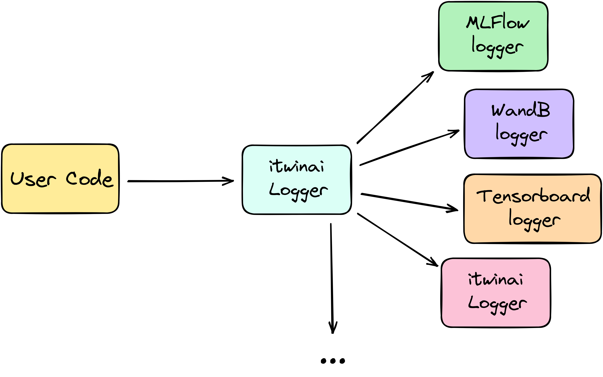

Logging your data
===========

Itwinai's `logger` wrapper provides a single method to log your data of interest regardless of which library you use under the hood.
The supported kinds of loggers are listed in :doc:`this table <../../../src/loggers.py>`

.. _logger_fig:

The loggers currently supported are shown in :ref:`this figure <logger_fig>`.

To see your logs 

.. note::
    The default value for (?) is (?)

