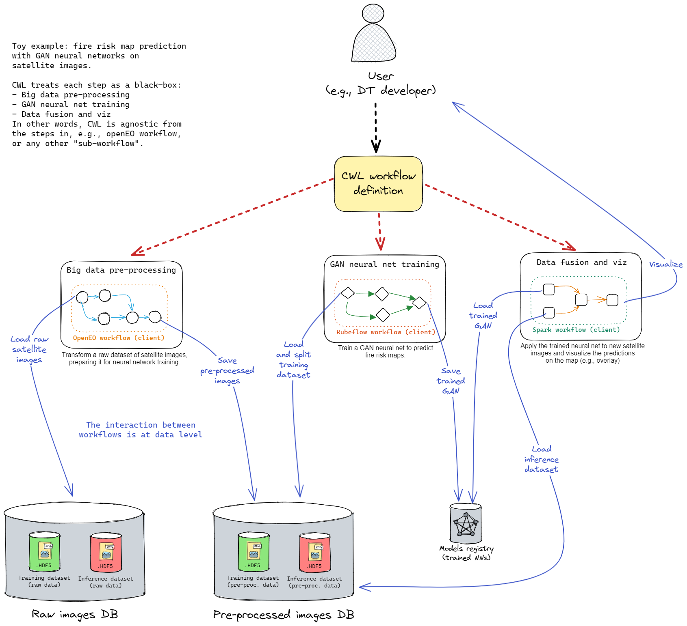

# Overview

Welcome to the `itwinai` docs! A framework for advanced AI/ML workflows in digital twins (DTs).

Below we you are going to find an overview of interTwin's AI/ML workflows component. This platform
is intended to support general-purpose MLOps for digital twin use cases in interTwin.

Additional resources include:

- Detailed instructions on [How to use this software](docs/How-to-use-this-software).
- Roadmap towards a prototype for T6.5 AI workflows for
digital twins here: [Prototype for T6.5](docs/Prototype-for-T6.5).

## Platform for machine learning workflows in digital twins

The goal of this platform is to provide ML researchers with an easy-to-use endpoint
to manage general-purpose machine learning (ML) workflows, with limited engineering overhead,
and providing state-of-the-art MLOps practices.

We call this platform `itwinai`.

The user is going to provide as input an set of configuration files, to fully describe ML workflows,
in the context of digital twin (DT) applications. itwinai platform produces as output a
visualization of ML metrics produced by executing the input ML configuration. As a result of ML
training, the best model (on validation set) is saved to the Models Registry for future inference jobs.

### Simulating a whole DT workflow

A DT workflow is more than ML. Generally speaking, MLOps (like training and validation, prediction,
ML model lifecycle management), can be considered just as a step of a larger DT workflow.

In itwinai platform, we focus mainly on the MLOps step, simulating or oversimplifying all the rest
(e.g., pre-processing, user authentication).

For further details on how to define a DT workflow in itwinai, follow [this guide](docs/How-to-use-this-software#2-define-a-dt-workflow).

### How to integrate a new use case

To integrate an existing use case in itwinai platform, the ML engineer rewrites her ML experiments
according to a format supported by itwinai. Some examples can be found by looking at the use cases
already integrated [here](docs/use-cases/index), located at `use-cases/`.

A detailed guide on how to integrate a new use case in itwinai can be found [here](docs/How-to-use-this-software).
