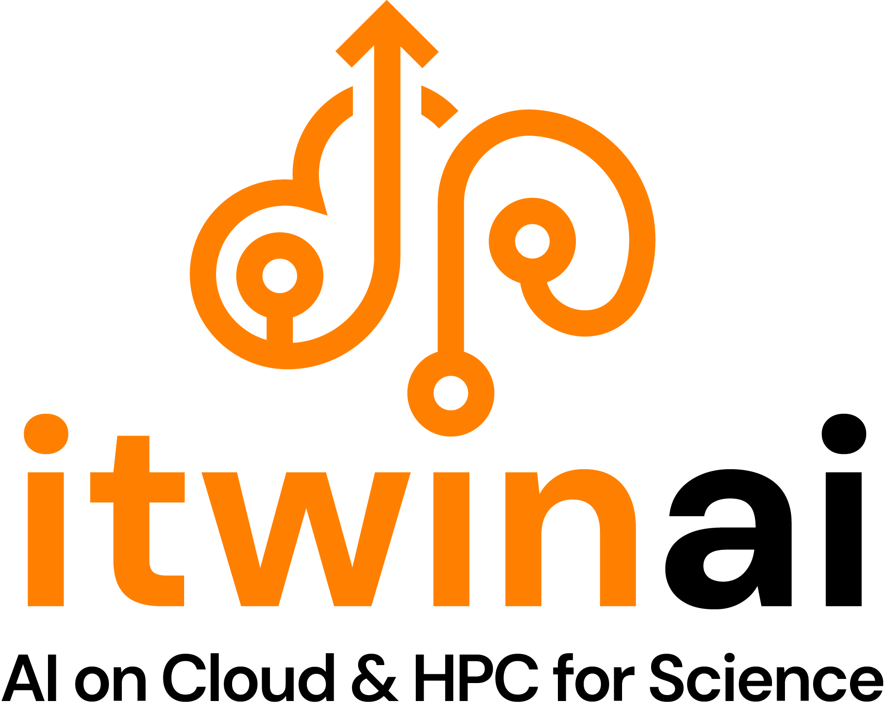

.. itwinai documentation master file, created by
   sphinx-quickstart on Fri Feb  9 13:58:30 2024.
   You can adapt this file completely to your liking, but it should at least
   contain the root `toctree` directive.

.. |br| raw:: html

    

|br|
|br|
|br|

Welcome to itwinai's documentation!
===================================

``itwinai`` is a framework for advanced AI/ML workflows in Digital Twins (DTs).

This platform is intended to support general-purpose MLOps for Digital Twin use cases in the `interTwin <https://www.intertwin.eu/>`_ project.

Platform for machine learning workflows in digital twins
++++++++++++++++++++++++++++++++++++++++++++++++++++++++

The goal of this platform is to provide ML researchers with an easy-to-use endpoint to manage general-purpose ML workflows, 
with limited engineering overhead, while providing state-of-the-art MLOps best practices.

How to read the docs
++++++++++++++++++++

To effectively utilize the ``itwinai`` framework documentation, start by exploring the "Getting started" section. 
This section is crucial for understanding  the basics, setting up the framework, including detailed instructions for 
different types of installations such as User Installation either on HPC or on your laptop and Developer Installation. 
For a deeper understanding of the toolkit's core functionalities, refer to the "How It Works" section, which covers
key concepts addressed by itwinai.

The "Scientific Use Cases" section provides practical examples and interTwin project use cases' scenarios where ``itwinai``
has been applied, offering valuable insights into real-world applications. 
To further enhance your skills, explore the "Tutorials" section, which includes comprehensive 
guides on Distributed ML training and ML workflow tutorials. Lastly, the "Python API Reference" section is an essential 
resource for detailed information on the framework's API, helping you to implement specific features and functions in your projects. 
By following these sections systematically, you can maximize your understanding and effective use of the ``itwinai`` framework.

``itwinai`` documentation also offers different versions, such as the 'latest', 'stable', and 'v0.2.1'. 
The 'latest' version includes the most recent updates and features reflecting `main <https://github.com/interTwin-eu/itwinai>`_ branch developments, 
while the 'stable' version tracks the most recent project release based on semantic tagging and is recommended for production 
use due to its reliability (`learn more <https://docs.readthedocs.io/en/stable/versions.html#version-states>`_). 

.. The 'dev' version contains the latest development changes and is suitable for contributors and early testers, 
   reflecting `dev <https://github.com/interTwin-eu/itwinai/tree/dev>`_ branch.

.. toctree::
   :maxdepth: 2
   :hidden:
   :caption: 💡 Getting started

   getting-started/getting_started_with_itwinai
   getting-started/slurm

.. toctree::
   :maxdepth: 2
   :hidden:
   :caption: 🪄 How it works

   how-it-works/training/training
   how-it-works/workflows/explain_workflows

.. toctree::
   :maxdepth: 2
   :hidden:
   :caption: 🚀 Tutorials

   tutorials/tutorials

.. toctree::
   :maxdepth: 2
   :hidden:
   :caption: 📚 Scientific Use Cases

   use-cases/use_cases

.. toctree::
   :maxdepth: 2
   :hidden:
   :caption: ⚡ Python API reference

   python-api/modules

.. toctree::
   :maxdepth: 2
   :hidden:
   :caption: 🎯 Github repository

   itwinai <https://github.com/interTwin-eu/itwinai>

.. .. toctree::
..    :maxdepth: 2
..    :hidden:
..    :caption: Additional resources

..    notebooks/example

interTwin Demo: itwinai integration with other DTE modules 
++++++++++++++++++++++++++++++++++++++++++++++++++++++++++

.. raw:: html
   
   <iframe width="560" height="315" src="https://www.youtube.com/embed/NoVCfSxwtX0" title="interTwin demo: itwinai (WP6)" frameborder="0" allow="accelerometer; autoplay; clipboard-write; encrypted-media; gyroscope; picture-in-picture; web-share" referrerpolicy="strict-origin-when-cross-origin" allowfullscreen></iframe>

|
|
|

Indices and tables
++++++++++++++++++

* :ref:`genindex`
* :ref:`modindex`

.. * :ref:`search`

