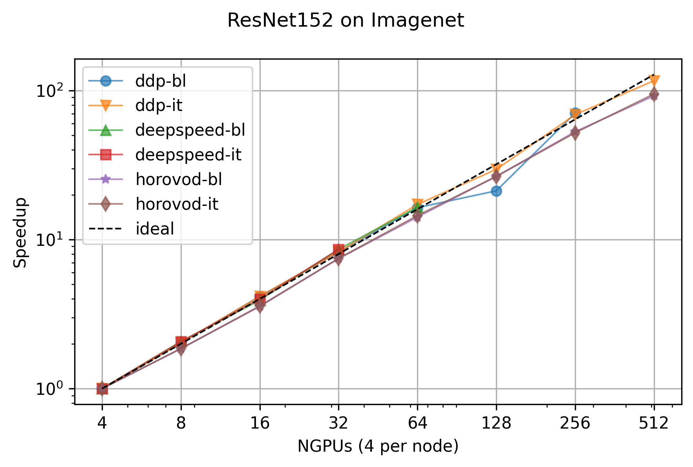

PyTorch scaling test
====================

Scaling tests for PyTorch of ResNet152 on Imagenet
--------------------------------------------------

Introduction
++++++++++++

This tutorial contains six training configurations: three baselines plus the itwinai
trainer, which allows to switch from DDP, Horovod, and DeepSpeed in a simplified way.

The training scripts are:

- ``ddp_trainer.py``: baseline of distributed training with vanilla torch DDP
- ``deepspeed_trainer.py``: baseline of distributed training with vanilla Microsoft DeepSpeed
- ``horovod_trainer.py``: baseline of distributed training with vanilla Horovod
- ``itwinai_trainer.py``: provides the same functionalities as all the above, using the unified itwinai's distributed training interface.

Configuration files are stored into ``config/`` folder. ``base.yaml`` provides the
configuration common to all training experiments, whereas ``ddp.yaml``, ``deepspeed.yaml``,
and ``horovod.yaml`` provide framework-specific configuration.
Thanks to ``itwinai.parser.ArgumentParser``, the CLI arguments can be parsed from a list of
configuration files, while also allowing for online override.
Example:

.. code-block:: bash

    # Rather than requiring a LONG list of inline configuration params...
    python ddp_trainer.py --data-dir some/dir --log-int 10 --verbose --nworker 4 ...

    # ...itwinai's ArgumentParser allows to load them from a set of configuration files
    # with inline override, if needed
    python ddp_trainer.py -c config/base.yaml -c config/ddp.yaml --log-int 42

Run a single training
+++++++++++++++++++++

Training runs are meant to be submitted via SLURM, from a unified job script file:
``slurm.sh``.
You can select the distributed training algorithm and provide the command to execute
setting SLURM environment variables using the ``--export`` option:

.. code-block:: bash

    # Launch a distributed training setup with Torch DDP
    export DIST_MODE="ddp"
    export RUN_NAME="ddp-bl-imagenent"
    export TRAINING_CMD="ddp_trainer.py -c config/base.yaml -c config/ddp.yaml"
    export PYTHON_VENV="../../../envAI_hdfml"
    export N=2 # Number of nodes
    sbatch --export=ALL,DIST_MODE="$DIST_MODE",RUN_NAME="$RUN_NAME",TRAINING_CMD="$TRAINING_CMD",PYTHON_VENV="$PYTHON_VENV" \
        --job-name="$RUN_NAME-n$N" \
        --output="logs_slurm/job-$RUN_NAME-n$N.out" \
        --error="logs_slurm/job-$RUN_NAME-n$N.err" \
        --nodes=$N slurm.sh

Run all training configurations
+++++++++++++++++++++++++++++++

To run all training configurations you can use the ``runall.sh`` script, which provides
further insight how different training configurations can be launched using the same
SLURM job script.

.. code-block:: bash

    bash runall.sh

And check the newly created jobs in the SLURM queue:

.. code-block:: bash

    squeue -u YOUR_USERNAME

Each execution will generate a ``.csv`` file recording the time that each training epoch
took to complete. Below you can learn more on how to analyze these files to produce report.

Launch scaling test
+++++++++++++++++++

Similarly to ``runall.sh``, there is another script which is meant to launch a scalability
analysis experiment. This will launch all the training configuration for different number
of node allocations. By default it will run the same distributed trainings on 1, 2, 4, and
8 nodes. Each independent execution will generate a separate ``.csv`` file which can be
analyzed later to produce a scalability report.

Launch the scaling test:

.. code-block:: bash

    bash scaling-test.sh

And check the newly created jobs in the SLURM queue:

.. code-block:: bash

    squeue -u YOUR_USERNAME

Analyze results
+++++++++++++++

Once all jobs have completed, you can automatically generate scalability report
using itwinai's CLI:

.. code-block:: bash

    # First, activate you Python virtual environment

    # For more info run
    itwinai scalability-report --help

    # Generate a scalability report
    itwinai scalability-report --pattern="^epoch.+\.csv$" \
        --plot-title "ResNet152 on Imagenet" --archive imagenet_results

The last command prints to terminal the average epoch time per training
configuration and per number of nodes, and it generated scaling test
analysis plot, which is saved as ``.png`` file. This command will also
create a ``.tar.gz`` archive of all the analyzed ``.csv`` files and  
the generated plots, allowing you to easily organize different experiments
and reducing the risk of overwriting the logs generated during the scaling
test.

Example of scalability plot generated by ``itwinai scalability-report``:

Configuration files
-------------------

base.yaml
+++++++++

.. literalinclude:: ../tutorials/distributed-ml/torch-scaling-test/config/base.yaml
   :language: yaml

ddp.yaml
++++++++

.. literalinclude:: ../tutorials/distributed-ml/torch-scaling-test/config/ddp.yaml
   :language: yaml

deepspeed.yaml
++++++++++++++

.. literalinclude:: ../tutorials/distributed-ml/torch-scaling-test/config/deepspeed.yaml
   :language: yaml

horovod.yaml
++++++++++++

.. literalinclude:: ../tutorials/distributed-ml/torch-scaling-test/config/horovod.yaml
   :language: yaml

Training scripts and utils
--------------------------

ddp_trainer.py
++++++++++++++

.. literalinclude:: ../tutorials/distributed-ml/torch-scaling-test/ddp_trainer.py
   :language: python

deepspeed_trainer.py
++++++++++++++++++++

.. literalinclude:: ../tutorials/distributed-ml/torch-scaling-test/deepspeed_trainer.py
   :language: python

horovod_trainer.py
++++++++++++++++++

.. literalinclude:: ../tutorials/distributed-ml/torch-scaling-test/horovod_trainer.py
   :language: python

itwinai_trainer.py
++++++++++++++++++

.. literalinclude:: ../tutorials/distributed-ml/torch-scaling-test/itwinai_trainer.py
   :language: python

utils.py
++++++++

.. literalinclude:: ../tutorials/distributed-ml/torch-scaling-test/utils.py
   :language: python

runall.sh
+++++++++++++++++++

.. literalinclude:: ../tutorials/distributed-ml/torch-scaling-test//runall.sh
   :language: bash

scaling-test.sh
+++++++++++++++++++

.. literalinclude:: ../tutorials/distributed-ml/torch-scaling-test/scaling-test.sh
   :language: bash

slurm.sh
+++++++++++++++++++

.. literalinclude:: ../tutorials/distributed-ml/torch-scaling-test/slurm.sh
   :language: bash

