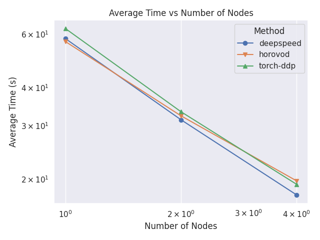
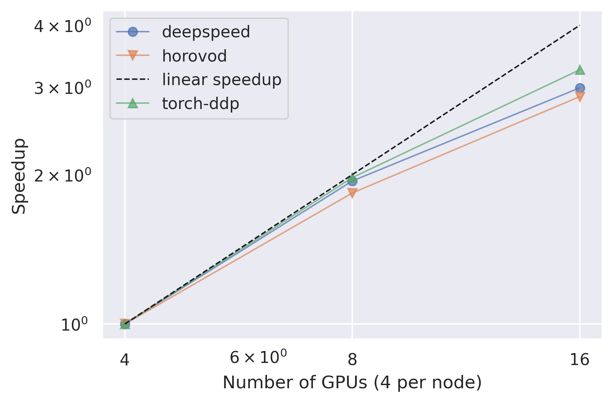
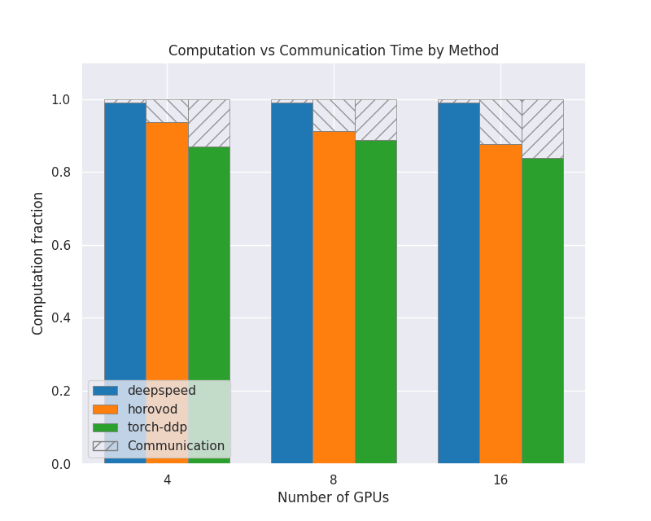
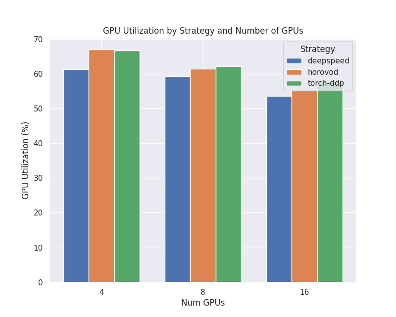
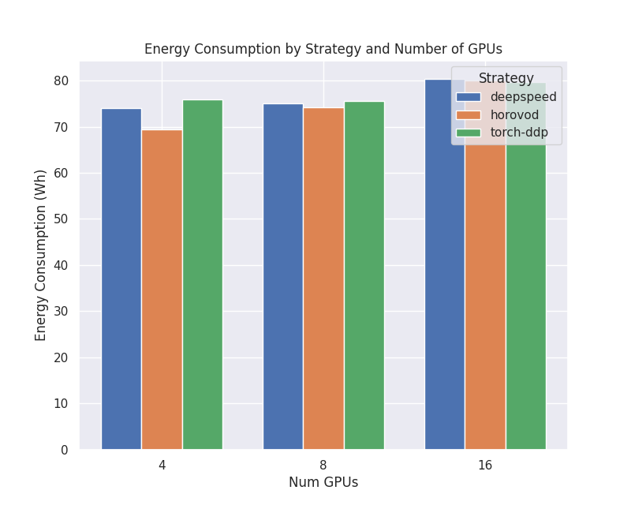

PyTorch scaling test
====================

.. include:: ../../../tutorials/distributed-ml/torch-scaling-test/README.md
   :parser: myst_parser.sphinx_

Plots of the scalability metrics
--------------------------------

We have the following scalability metrics available: 

- Absolute wall-clock time comparison
- Relative wall-clock time speedup
- Communication vs. Computation time
- GPU Utilization (%)
- Power Consumption (Watt)

Some examples of these scalability metrics on the Virgo use case with one, two and four
nodes respectively can be seen below: 

Absolute Wall-Clock Time Comparison
~~~~~~~~~~~~~~~~~~~~~~~~~~~~~~~~~~~

Relative Wall-Clock Time Speedup
~~~~~~~~~~~~~~~~~~~~~~~~~~~~~~~~

Communication vs Computation
~~~~~~~~~~~~~~~~~~~~~~~~~~~~

GPU Utilization
~~~~~~~~~~~~~~~

Power Consumption
~~~~~~~~~~~~~~~~~

