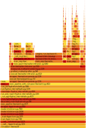

Profiling using the ``py-spy`` Profiler
=======================================

This tutorial will show how you can profile using ``py-spy``.

You can see an example of a success story in our page,
:doc:`Profiling Lattice QCD with the py-spy profiler<py-spy-lattice-qcd-example>`.

Introduction
------------

The ``py-spy`` profiler is a statistical Python profiler made for finding bottlenecks in your
code. It works by periodically sampling the call stack of your program and summarizing which
locations your code spends the most time in. ``itwinai`` integrates with this profiler by
adding CLI commands for launching it and by providing a specialized data aggregation. You
can read more about the ``py-spy`` profiler in the 
`py-spy documentation <https://github.com/benfred/py-spy/>`_ and see all the CLI functions
in the 
`itwinai CLI documentation <https://itwinai.readthedocs.io/latest/api/cli_reference.html>`_.

Quickstart
----------

To profile your training script, you can prepend the ``py-spy record`` command, together with
two hyphens, ``--``, to separate arguments for the profiler and your own code, to your training
command as follows:

.. code-block:: bash

    py-spy record -- <your_training_command>

As an example, if I typically launch my training pipeline with ``itwinai exec-pipeline``, then
I can do the following to profile my program:

.. code-block:: bash

    py-spy record -- itwinai exec-pipeline

Sampling Rate
-------------

Since the ``py-spy`` profiler is a statistical profiler, it will become more precise the more
samples you get. By default, it samples your process 100 times a second. One way to increase
the number of samples is by increasing the sampling rate. This is controlled by the ``-r`` 
flag. Thus, if you wanted to sample your program 250 times per second instead, you could do
the following:

.. code-block:: bash

    py-spy record -r 250 -- <your_training_command>

E.g. if you use the ``itwinai`` pipeline as mentioned before, you would do the following:

.. code-block:: bash

    py-spy record -r 250 -- itwinai exec-pipeline

Output File and Format
----------------------

By default, the ``py-spy`` profiler outputs a FlameGraph (more on FlameGraphs in the
`FlameGraph GitHub <https://github.com/brendangregg/FlameGraph/>`_). However, if you wish to 
use the ``itwinai`` data aggregation tool, then you need to set the format to ``raw`` using
the ``-f`` flag. With our previous ``itwinai`` pipeline example, this would be:

.. code-block:: bash

    py-spy record -f raw -- itwinai exec-pipeline

This will create a file containing the stack traces, which can later be used for either
data aggregation or to construct a FlameGraph. 

You can specify the name of the output file using the ``-o`` flag. For example, if you wanted
to store your output in a directory called ``py-spy-outputs`` with the name 
``profiling_output.txt``, then you would do the following:

.. code-block:: bash

   py-spy record -o py-spy-outputs/profiling_output.txt -- <your_training_command>

.. warning::

   If you're specifying a specific directory for your outputs, then make sure the directory
   already exists as ``py-spy record`` will not create it for you.

You can combine both of these flags to both specify the raw format and name the output file
as follows:

.. code-block:: bash

   py-spy record -o py-spy-outputs/profiling_output.txt -f raw -- <your_training_command>

Generating Data-Aggregation Report
----------------------------------

Once you have generated your raw output, you can generate a data-aggregation report by using
the ``itwinai generate-py-spy-report`` command. Assuming that your output file is located
at ``py-spy-outputs/profiling_output.txt``, you can generate the report using the following 
command:

.. code-block:: bash

   itwinai generate-py-spy-report --file py-spy-outputs/profiling_output.txt

This will result in a table containing the deepest functions in your call stack that your
training script spent the most time in. In deep-learning contexts, you would usually
expect this to consist of the backward pass or the forward pass. Thus, if something else is at
the top, it might be sign that you could optimize your code further. 

.. warning::

   If your code includes some level of multiprocessing (e.g. Dataloading subprocesses) then
   some of these calls might be counted multiple times (once per process), meaning that you
   could get some overrepresentation. Take this into account when interpreting the result.

You can also specify a library name to tag, to give you an entrypoint to the function in
question. The idea is that seeing ``numpy.sum()`` as the most time-consuming function in your
program is not very useful if you don't know which part of your own code actually leads to 
this. Therefore, the aggregation also finds the lowest call that includes your library of 
choice, so that you can identify which part of your own code triggered the time-consuming
``numpy`` function. The library name can be specified using the ``--library-name`` flag
and is by default set to ``itwinai``. 

Sometimes you might also have multiple call stacks that bottom out into the same functions.
Thus, you can end up with a bunch of duplicates in your table, potentially cluttering your
results. These can be grouped together using the ``--aggregate-leaf-paths`` flag, making
every entry in your table unique. 

The following is an example of a table from an MNIST job:

.. code-block::

  name                      | path                                   |   line | library_function_name      | library_function_path    |   library_function_line | proportion (n)
  ---------------------------+----------------------------------------+--------+----------------------------+--------------------------+-------------------------+------------------
   _engine_run_backward      | site-packages/torch/autograd/graph.py  |    769 | train_step                 | itwinai/torch/trainer.py |                    1288 | 53.05% (7468)
   _conv_forward             | site-packages/torch/nn/modules/conv.py |    454 | train_step                 | itwinai/torch/trainer.py |                    1285 | 22.48% (3164)
   _max_pool2d               | site-packages/torch/nn/functional.py   |    796 | train_step                 | itwinai/torch/trainer.py |                    1285 | 5.11% (719)
   _conv_forward             | site-packages/torch/nn/modules/conv.py |    454 | validation_step            | itwinai/torch/trainer.py |                    1377 | 3.83% (539)
   _call_with_frames_removed | built-in                               |     -1 | exec_pipeline_with_compose | itwinai/cli.py           |                     658 | 1.02% (143)
   _max_pool2d               | site-packages/torch/nn/functional.py   |    796 | validation_step            | itwinai/torch/trainer.py |                    1377 | 0.84% (118)
   dropout2d                 | site-packages/torch/nn/functional.py   |   1387 | train_step                 | itwinai/torch/trainer.py |                    1285 | 0.65% (91)
   relu                      | site-packages/torch/nn/functional.py   |   1500 | train_step                 | itwinai/torch/trainer.py |                    1285 | 0.54% (76)
   get_data                  | built-in                               |     -1 | exec_pipeline_with_compose | itwinai/cli.py           |                     658 | 0.52% (73)
   spawnv_passfds            | multiprocessing/util.py                |    456 | validation_epoch           | itwinai/torch/trainer.py |                    1320 | 0.46% (65)

In the table, we have the following columns:

* **name**: This is the name of the lowest function in the call stack.
* **path**: This is the path to the file where the function resides.
* **line**: This is the exact line in the file above that was sampled.
* **library_function_name**: This is the name of the lowest function that was called in your
  specified library.
* **library_function_path**: This is the path to the file where the aforementioned function
  resides.
* **library_function_line**: This is the exact line in the file above that was sampled. 
* **proportion (n)**: This is the percentage of total samples that landed in this specific
  entry in the table. The number inside the parenthesis is the exact number of samples for
  this entry.

This example was run on a laptop without access to a GPU, and as expected we see that most
of the time was spent in the backward pass. This most likely means that there are no
obvious bottlenecks to optimize. 

Generating FlameGraph
---------------------

You can also use your profiling output to create a 
`FlameGraph <https://github.com/brendangregg/FlameGraph/>`_. This can be done with the
``itwinai`` `generate-flamegraph` command. As an example, if you stored your profiling output
in the file ``py-spy-outputs/profiling_output.txt``, then you could generate a FlameGraph
with the following command:

.. code-block:: bash

   itwinai generate-flamegraph --file py-spy-outputs/profiling_output.txt

You can see an example of a FlameGraph—made using the same data as the table above—here:

.. note::

   Typically the FlameGraphs are interactive, meaning you can click around on them and focus
   on smaller parts of the image. The image embedded in this tutorial does not support this,
   but when generating one yourself you will get an interactive one.

.. note::

   The image below has been slightly modified for the sake of fitting better. In particular,
   we have removed some of the longer call stacks as they made the image very tall. Therefore
   you can typically expect a real FlameGraph to be somewhat taller than the one seen here.

.. 
   This HTML segment is to add more space between the image and the subsequent paragraph.

.. raw:: html

   

Distributed Profiling
---------------------

When training your model in a distributed manner, i.e. with multiple GPUs and potentially
multiple nodes, there are certain considerations that have to be made. Typically you would
launch your distributed training using ``torchrun``, which will spawn multiple processes of
your training loop. If you want to get the full data from each process, you have to make
sure that each of these processes is profiled using ``py-spy``. This can be done by
appending the ``py-spy record`` command in front of your ``torchrun`` command as follows:

.. code-block:: bash

   py-spy record -s -f raw -- torchrun <torchrun_flags> <your_training_command>

.. note::

   We use the ``-s`` flag here as this allows ``py-spy`` to monitor all subprocesses. 

If you run your code in a multi-node setting with SLURM, then your ``srun`` command is going
to launch ``torchrun`` once per node. To make sure you run profiling on each node and also
avoid race conditions, you want to automatically name your output file based on the node id.
An example of such a command can be seen here:

.. code-block:: bash

    srun --cpu-bind=none --ntasks-per-node=1 \
    bash -c "py-spy record -s -o py-spy-outputs/profile_node\$SLURM_NODEID.txt -f raw -- torchrun \
    --log_dir='logs_torchrun' \
    --nnodes=$SLURM_NNODES \
    --nproc_per_node=$SLURM_GPUS_PER_NODE \
    --rdzv_id=$SLURM_JOB_ID \
    --rdzv_conf=is_host=\$(((SLURM_NODEID)) && echo 0 || echo 1) \
    --rdzv_backend=c10d \
    --rdzv_endpoint='$(scontrol show hostnames "$SLURM_JOB_NODELIST" | head -n 1)'i:29500 \
    $(which itwinai) exec-pipeline"

This shows a typical SLURM script for distributing a multi-node job. We show the full command
for completeness, but the important thing here is the ``py-spy record`` command and the 
``$SLURM_NODEID`` in the output name. In this example, we store each output in the 
``py-spy-outputs`` directory and each node gets its own name. For example, the first node 
would store its outputs in the file ``py-spy-outputs/profile_node0.txt``, the second in 
``py-spy-outputs/profile_node1.txt`` etc.

In ``itwinai``, this is all done automatically using the SLURM builder. To enable profiling
with ``py-spy`` in the SLURM configuration, you can set ``py_spy: true``. 
