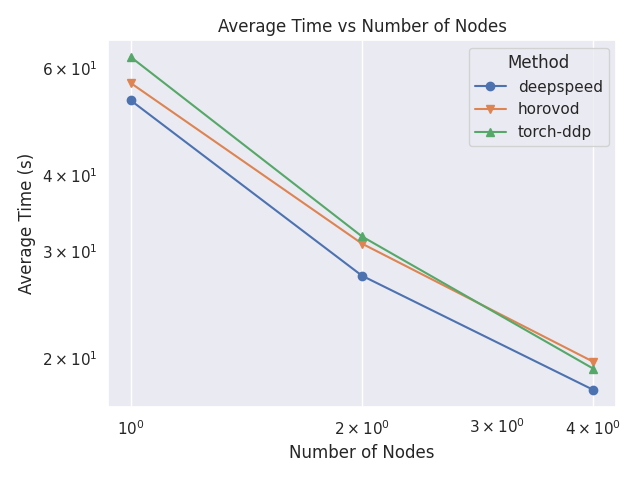
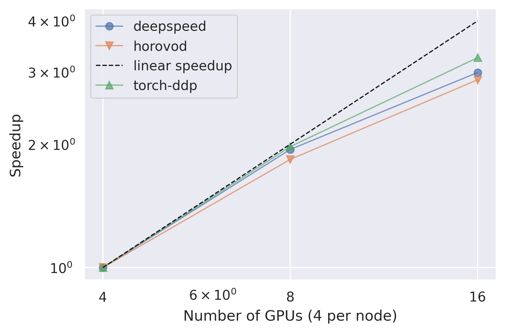
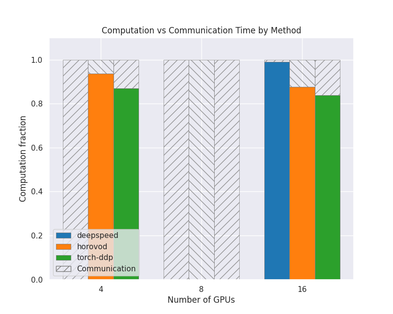
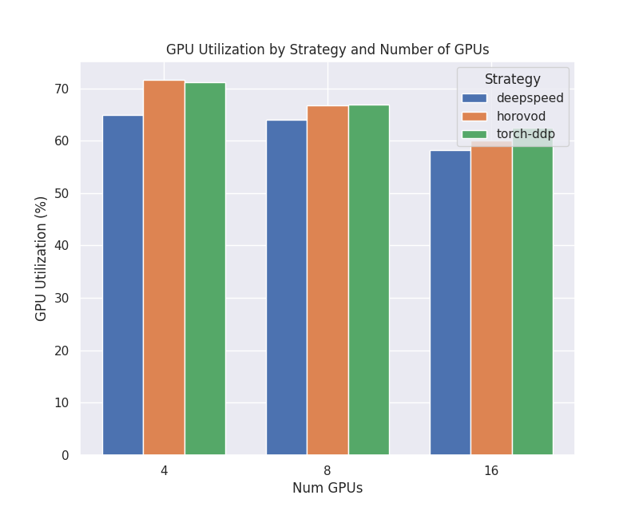
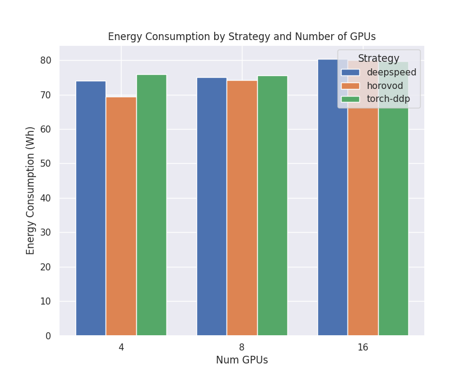

Noise Simulation for Gravitational Waves Detector (Virgo, INFN)
===============================================================

The code is adapted from
`this notebook <https://github.com/interTwin-eu/DT-Virgo-notebooks/blob/main/WP_4_4/interTwin_wp_4.4_synthetic_data.ipynb>`_
available on the Virgo use case's `repository <https://github.com/interTwin-eu/DT-Virgo-notebooks>`_.

To know more on the interTwin Virgo Noise detector use case and its DT, please visit the published deliverables,
`D4.2 <https://zenodo.org/records/10417138>`_, 
`D7.2 <https://zenodo.org/records/10417161>`_ and `D7.4 <https://zenodo.org/records/10224277>`_.

You can find the relevant code in the
`use case's folder on Github <https://github.com/interTwin-eu/itwinai/tree/main/use-cases/virgo>`_,
or by consulting the use case's README: 

.. include:: ../../use-cases/virgo/README.md
   :parser: myst_parser.sphinx_
   :start-line: 2

Scalability Metrics
-------------------
Here are some examples of the scalability metrics for this use case: 

Average Epoch Time Comparison
~~~~~~~~~~~~~~~~~~~~~~~~~~~~~
This plot shows a comparison between the average time per epochs for each strategy
and number of nodes. 

Relative Epoch Time Speedup
~~~~~~~~~~~~~~~~~~~~~~~~~~~
This plot shows a comparison between the speedup between the different number of nodes
for each strategy. The speedup is calculated using the lowest number of nodes as a
baseline.

Communication vs Computation
~~~~~~~~~~~~~~~~~~~~~~~~~~~~
This plot shows how much of the GPU time is spent doing computation compared to
communication between GPUs and nodes, for each strategy and number of nodes. The shaded
area is communication and the colored area is computation. They have all been
normalized so that the values are between 0 and 1.0. 

GPU Utilization
~~~~~~~~~~~~~~~
This plot shows how high the GPU utilization is for each strategy and number of nodes,
as a percentage from 0 to 100. This is the defined as how much of the time is spent
in computation mode vs not, and does not directly correlate to FLOPs. 

Power Consumption
~~~~~~~~~~~~~~~~~
This plot shows the total energy consumption in watt-hours for the different strategies
and number of nodes. 

