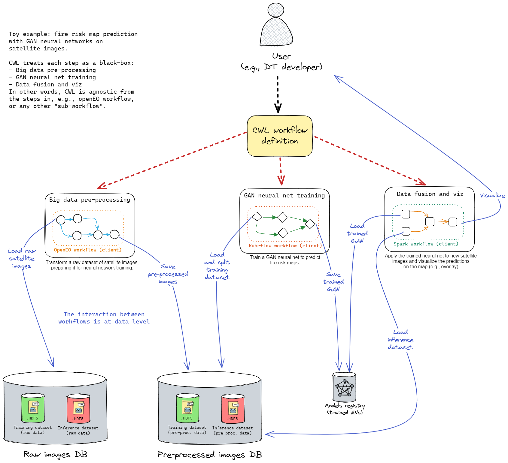

# Overview

Welcome to the `itwinai` docs! A framework for advanced AI/ML workflows in digital twins (DTs).

Below we you are going to find an overview of interTwin's AI/ML workflows component. This platform
is intended to support general-purpose MLOps for digital twin use cases in [interTwin](https://www.intertwin.eu/) project.

> Beware! As the code is frequently changed, the docs are unstable and may not reflect the actual state of the code base.
> Therefore, if you are looking for a more stable version, check out our
> [releases](https://github.com/interTwin-eu/T6.5-AI-and-ML/releases).

Additional resources include:

- Detailed instructions on [How to use this software](docs/How-to-use-this-software).
- Roadmap towards a prototype for T6.5 AI workflows for
digital twins here: [Prototype for T6.5](https://github.com/interTwin-eu/T6.5-AI-and-ML/wiki/Prototype-for-T6.5).

## Platform for machine learning workflows in digital twins

The goal of this platform is to provide ML researchers with an easy-to-use endpoint
to manage general-purpose machine learning (ML) workflows, with limited engineering overhead,
while providing state-of-the-art MLOps best practices.

We call this platform `itwinai`.

The user is going to provide as input a set of configuration files, to fully
describe ML workflows, in the context of digital twin (DT) applications.
`itwinai` platform instantiates ML workflows with the configurations
provided by the DT developer. The execution of ML workflows produces as output a
set of ML metrics, which are visualized by `itwinai` via
[MLFlow](https://mlflow.org/).
As a result of ML training, the best model (on validation dataset)
is saved to the *Models Registry* for future predictions.

### Simulating a whole DT workflow

A DT workflow is more than ML. Generally speaking, MLOps
(i.e., ML model lifecycle management),
can be considered just as a step of a larger DT workflow.

In `itwinai` platform, we focus mainly on the MLOps step, simulating or oversimplifying all the rest
(e.g., pre-processing, authentication, workflow execution).

For further details on how to define a DT workflow in `itwinai`, follow [this guide](docs/How-to-use-this-software#2-define-a-dt-workflow).

### How to integrate a new use case

To integrate an existing use case in this platform, the ML engineer rewrites
the ML experiments according to a format supported by `itwinai`.
Some examples can be found by looking at the use cases
already integrated [here](docs/use-cases/index), located under `use-cases/`
in the code repository.

A detailed guide on how to integrate a new use case in `itwinai` can be found [here](docs/How-to-use-this-software).
