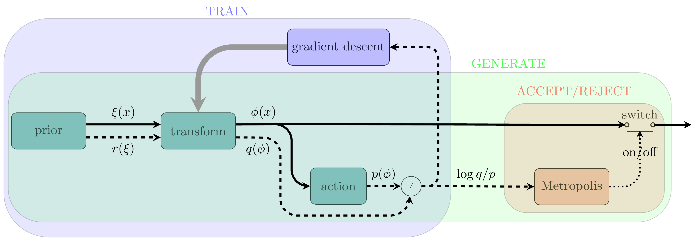

normflow
[](https://api.eu.badgr.io/public/assertions/-g9rQYZJTyi4S-VUrbvqlQ "SQAaaS silver badge achieved")
[](/LICENSE)
--------
This package provides utilities for implementing the
**method of normalizing flows** as a generative model for lattice field theory.

The method of normalizing flows is a powerful generative modeling approach that
learns complex probability distributions by transforming samples from a simple
distribution through a series of invertible transformations. It has found
applications in various domains, including generative image modeling.

The package currently supports scalar theories in any dimension, and we are
actively extending it to accommodate gauge theories, broadening its
applicability.

In a nutshell, three essential components are required for the method of
normalizing flows:

*   A **prior distribution** to draw initial samples.
*   A **neural network** to perform a series of invertible transformations on
    the samples.
*   An **action** that specifies the target distribution, defining the goal of
    the generative model.

The central high-level class of the package is called `Model`, which can be
instantiated by providing instances of the three objects mentioned above:
the prior, the neural network, and the action.

Following the terminology used by *scikit-learn*, each instance of `Model`
comes with a `fit` method, responsible for training the model. For those who
prefer an alternative to the scikit-learn terminology, an alias called `train`
is also available and functions identically. The training process involves
optimizing the parameters of the neural network to accurately map the prior
distribution to the target distribution.


Below is a simple example of a scalar theory in zero dimension, i.e.,
a scenario with one point and one degree of freedom:


```python
from normflow import Model
from normflow.action import ScalarPhi4Action
from normflow.prior import NormalPrior
from normflow.nn import DistConvertor_

def make_model():
    # Define the prior distribution
    prior = NormalPrior(shape=(1,))

    # Define the action for a scalar \phi^4 theory
    action = ScalarPhi4Action(kappa=0, m_sq=-2.0, lambd=0.2)

    # Initialize the neural network for transformations
    net_ = DistConvertor_(knots_len=10, symmetric=True)

    # Create the Model with the defined components
    model = Model(net_=net_, prior=prior, action=action)

    return model

# Instantiate and train the model
model = make_model()
model.fit(n_epochs=1000, batch_size=1024, checkpoint_dict=dict(print_stride=100))
```

In this example, we have:

-   **Prior Distribution**: A normal distribution is used with a shape of
    `(1,)`; one could also set `shape=1`.

-   **Action**: A quartic scalar theory is defined with parameters
    `kappa=0`, `m_sq=-2.0`, and `lambda=0.2`.

-   **Neural Network**: The `DistConvertor_` class is used to create the
    transformation network, with `knots_len=10` and symmetry enabled.
    Any instance of this class converts the probability distribution of inputs
    using a rational quadratic spline. In this example, the spline has 10 knots,
    and the distribution is assumed to be symmetric with respect to the origin.

-   **Training**: The model is trained for `1000` epochs with a batch size of
    `1024`. Progress is printed every `100` epochs.

This example demonstrates the flexibility of using the package to implement
scalar field theories in a simplified zero-dimensional setting. It can be
generalized to any dimension by changing the shape provided to the prior
distribution.

The above code block results in an output similar to:

    >>> Checking the current status of the model <<<
    Epoch: 0 | loss: -1.8096 | ess: 0.4552 | log(p): 0.4(11)
    >>> Training started for 1000 epochs <<<
    Epoch: 100 | loss: -2.0154 | ess: 0.6008 | log(p): 0.52(57)
    Epoch: 200 | loss: -2.1092 | ess: 0.7381 | log(p): 0.60(56)
    Epoch: 300 | loss: -2.1612 | ess: 0.8195 | log(p): 0.57(87)
    Epoch: 400 | loss: -2.2091 | ess: 0.8783 | log(p): 0.63(83)
    Epoch: 500 | loss: -2.2459 | ess: 0.9262 | log(p): 0.71(58)
    Epoch: 600 | loss: -2.2670 | ess: 0.9459 | log(p): 0.73(56)
    Epoch: 700 | loss: -2.2684 | ess: 0.9585 | log(p): 0.74(53)
    Epoch: 800 | loss: -2.2667 | ess: 0.9684 | log(p): 0.74(51)
    Epoch: 900 | loss: -2.2724 | ess: 0.9789 | log(p): 0.76(54)
    Epoch: 1000 | loss: -2.2673 | ess: 0.9791 | log(p): 0.75(62)
    >>> Training finished (cpu); TIME = 4.36 sec <<<


This output indicates the loss values at specified epochs during the training
process, providing insight into the model's performance over time.


After training the model, one can draw samples using an attribute called
`posterior`.
To draw `n` samples from the trained distribution, use the following command:

```python
x = model.posterior.sample(n)
```

Note that the trained distribution is almost never identical to the target
distribution, which is specified by the action. To generate samples that are
correctly drawn from the target distribution, similar to Markov Chain Monte
Carlo (MCMC) simulations, one can employ a Metropolis accept/reject step and
discard some of the initial samples. To this end, you can use the following
command:

```python
x = model.mcmc.sample(n)
```

This command draws `n` samples from the trained distribution and applies a
Metropolis accept/reject step to ensure that the samples are correctly drawn.

<p align="center">
    
</p>
<p align="center">
    Block diagram for the method of normalizing flows
</p>


The *TRAIN* and *GENERATE* blocks in the above figure depict the procedures for
training the model and generating samples/configurations. For more information
see [arXiv:2301.01504](https://arxiv.org/abs/2301.01504).

Moreover, the model has an attribute called `device_handler`, which can be used
to specify the number of GPUs used for training (the default value is one if
any GPU is available). To this end, you can use the following approach:

```python
def fit_func(model):
    model.fit(n_epochs=1000, batch_size=1024)

model.device_handler.spawnprocesses(fit_func, nranks)
```

In this code, `nranks` specifies the number of GPUs to be used for training.
You can efficiently scale your model training across multiple GPUs, enhancing
performance and reducing training time. This flexibility allows you to tackle
larger datasets and more complex models with ease.

In summary, this package provides a robust and flexible framework for
implementing the method of normalizing flows as a generative model for lattice
field theory. With its intuitive design and support for scalar theories, you
can easily adapt it to various dimensions and leverage GPU acceleration for
efficient training. We encourage you to explore the features and capabilities
of the package, and we welcome contributions and feedback to help us improve
and expand its functionality.

## itwinai integration

Integration of itwinai functionalities in normflow is based on allowing the
model to benefit from the `TorchTrainer` class provided by `itwinai`. This
enables, among other features, multi-node parallelism.
In order to install the `itwinai` environment, please follow the instructions provided 
[in the main README](../../README.md#environment-setup), and activate it. 
After that the use-case required packages, such as `normflow` should be installed.
This version provides `train.py` file to execute the workflow. Alternatively, one can use
the `exec-pipeline` CLI from `itwinai` to launch the workflow. A script to 
define the pipeline called `pipeline.yaml` is provided. In order to launch the
pipeline, simply run:
```
itwinai exec-pipeline --config pipeline.yaml
```
For working on HPC systems, additionally a `startscript.sh` file is provided. 
This can be launched by:```sbatch startscript.sh```. The version includes integration 
of loggers and  profiling tools provided by itwinai. 

| Created by Javad Komijani in 2021 \
| Copyright (C) 2021-24, Javad Komijani
