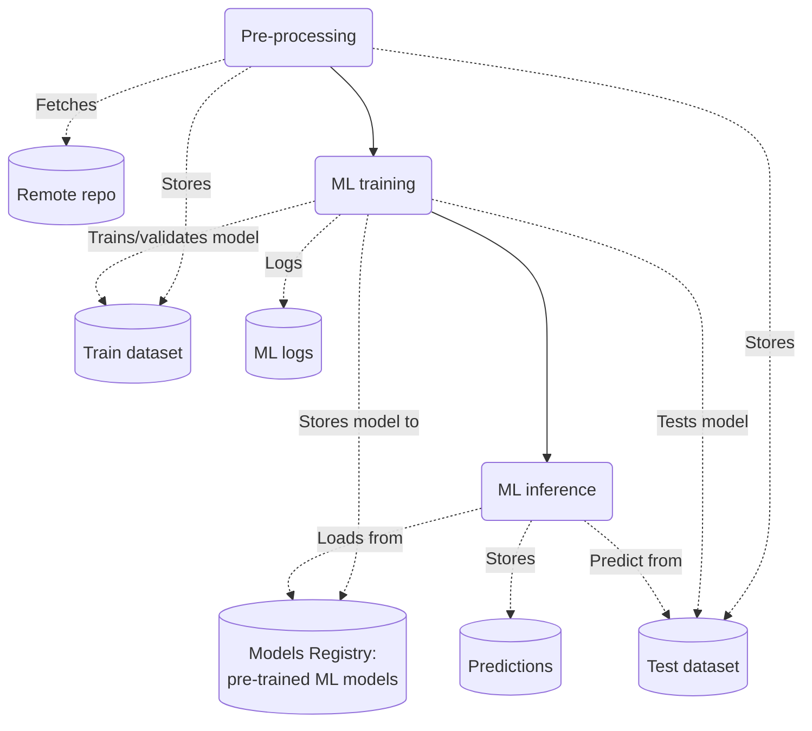

# MNIST: toy example for DT workflows

Of course MNIST images classification is not a digital twin. Still, it is useful to
provide an example on how to define an end-to-end digital twin workflow with the
software provided in this repository.

The two MNIST workflows can be summarized as follows:

1. Training workflow: train a neural network to classify MNIST images.

    ```mermaid
    flowchart LR
        %% Nodes
        preproc(Pre-processing)
        ai(ML training)
        reg[(Models Registry:\npre-trained ML models)]

        %% Workflow
        preproc --> ai

        %% Connections
        ai -.-> |Saves to| reg
    ```

1. Inference workflow: use the pre-trained neural network to classify unseen images (the test set, in this case).

    ```mermaid
        flowchart LR
            %% Nodes
            preproc(Pre-processing)
            ai_depl(ML inference)
            pred[(Predictions)]

            %% Workflow
            preproc --> ai_depl 

            %% Connections
            ai_depl -.-> |Saves to| pred
    ```

The interactions among workflows and their step can be described in more details as the following, where dependencies among different workflow steps are represented by solid arrows:



## Pre-processing

This step is implemented by executing `mnist-preproc.py` script in its dedicated conda environment, defined by
`preproc-env.yml`. This solution gives full freedom to the DT developer to implement any preprocessing logic, adaptable
to any custom dataset format.

## ML training

Is the step in which a neural network is trained on the training dataset, and validated on the validation dataset (these
two are a result from a further split of the pre-processed training dataset, produced by the pre-processing step).
This step terminates the **training workflow**, and results into ML logs and a trained neural network, which is saved to
the Models Registry. The training workflow can be re-run multiple times with different (hyper)parameters, with the goal
of optimizing some ML validation metric. The neural network with the best validation performances can be use to make
predictions on unseen data, in the inference step.

ML training logic is implemented by the `itwinai` library, requiring the DT developer to produce only a set of YAML
configuration files.

TODO: cite configuration files

## ML inference

A pre-trained neural network is applied to a set of data which was not used to train it. In fact, this is defined as
"unseen" data, from the neural network perspective. An example of ML inference is the application of a trained neural
network to make predictions on new data, to support decision making. *Example*: forecast fire risk maps in Sicily in
August 2023, starting from newly-collected satellite images, to alert local authorities in case of elevated fire risk.

TODO: cite configuration files

## References

To learn more on how to use this software, e.g., to deploy a new use case, please refer to [this guide](https://github.com/interTwin-eu/T6.5-AI-and-ML/wiki/How-to-use-this-software).
