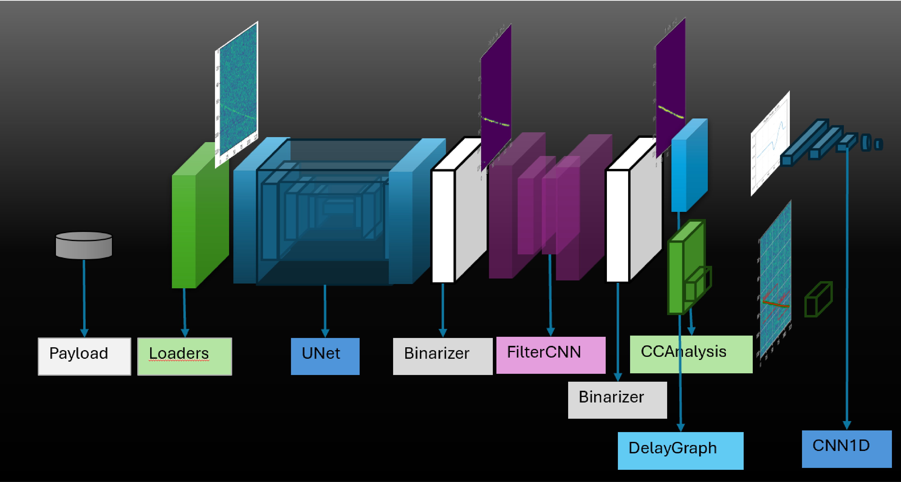
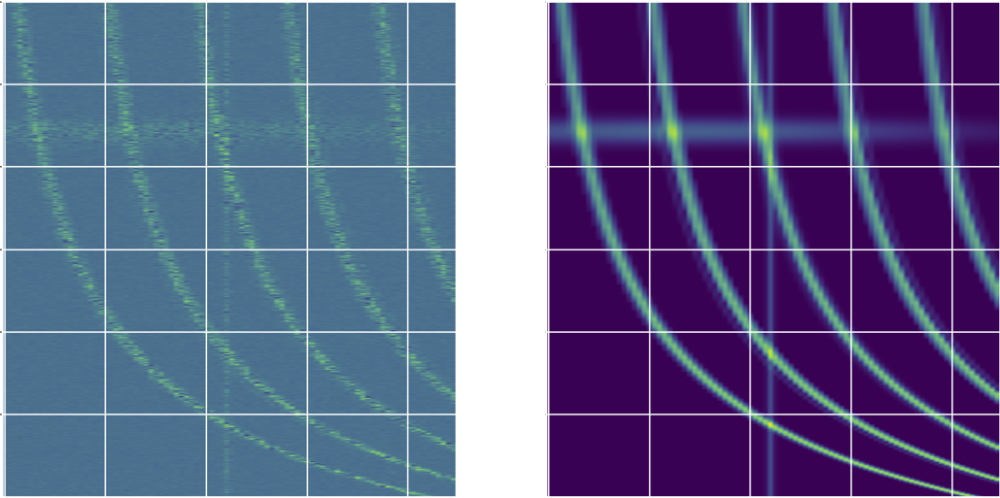
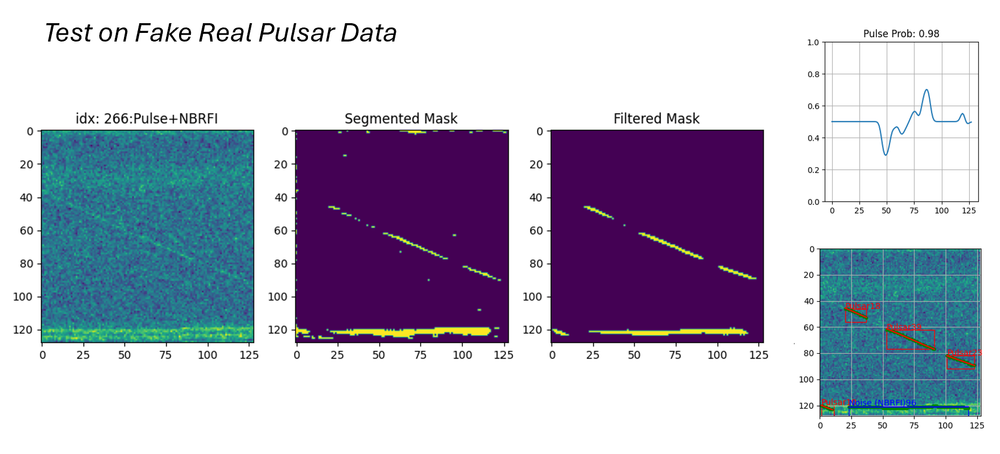

# Pulsar Segmentation and Analysis (PulsarS&A)


Welcome to the **Pulsar Segmentation and Analysis (PulsarS&A)** package of **ML-PPA**. This package is designed to provide robust pipelines for the segmentation and analysis of pulsar signals from frequency-time dispersion graphs. It includes tools and models that facilitate efficient processing and identification of pulsar signals from noisy observational data.

### What's new in version 0.2

In this version, we introduce several key updates compared to version 0.1:

- **Enhanced Connected Component Analysis** : The pipeline for classifying segments as pulsars has been streamlined, improving accuracy and efficiency in identifying meaningful connected components
- **DelayGraph** : A new method was introduced for generating signals based on dispersion curves. These signals are classified using both a neural network and a legacy linear curve-fitting method, combining modern and traditional techniques for robust analysis.
- **FilterCNN** : An additional layer of filtering was integrated into the segmentation process. This enhances the output from the UNet, improving the downstream classification of pulsar signals by refining the initial segmentation.
- **Modular Pipeline** : The entire workflow has been modularized using classes, enabling the development of custom pipelines tailored to specific needs. This ensures flexibility and adaptability in processing pipelines.

### Features

- **Pulse Trace Segmentation:** PulsarS&A leverages Convolutional Neural Networks (CNNs), specifically the **UNet architecture**, to accurately segment pulsar signals from frequency-time dispersion graphs.
  
- **Noise Filtering:** After segmentation, the pipeline applies a simple encoder-decoder CNN (referred to as **FilterCNN**) to filter out small noisy patches that may interfere with signal identification.

- **Signal Labeling:** The package employs connected component analysis and delay-graph analysis to further classify and label the segmented pulsar signals.

### Applications

PulsarS&A is designed to assist in automating the detection and analysis of pulsar signals in large datasets, streamlining the process for researchers working in the field of radio astronomy.

This repository provides both the core algorithms and the framework for training and deploying the neural networks required for pulsar signal segmentation.

If you want to run and test the code, we recommend starting with the  [Tutorial Project](https://gitlab.com/ml-ppa/tutorial_project), where you can use a containerized solution for convenience. 

You can also compile and run it locally using virtual environments; therefore, follow the steps explained in the next section. 

## Setup to run it locally
We recommend using virtual environment for running this package. This will help organize dependencies and avoid conflics with packages you have installed globally on your computer. You can create a virtual environment with the following command:

```
python3 -m venv <venv_name>
``` 
followed by activating the virtual environment as:
```
source <venv_name>/bin/activate
```
If you have activated the virtual environment, you should see the name <venv_name> at the beginning of the command prompt in your terminal. The required packages or dependencies then can be installed in the virtual environment as:
```
pip install -r requirements.txt
```
From here the example python script or the Jupyter Notebooks can be run. You can use the notebooks with a text editor like Visual Studio Code or by running a Jupyter server. To create a custom kernel and run the server use the following:
```
python -m ipykernel install --user --name=<venv_name>
jupyter notebook
```
### Introduction
The package is structured into subpackages:
* Preprocessing units [preprocessing](src/pulsar_analysis/preprocessing.py) 
* Postprocessing units [postprocessing](src/pulsar_analysis/preprocessing.py) 
* Training methods [train_neural_network_model](src/pulsar_analysis/train_neural_network_model.py)  
* Neural networks [neural_network_models](src/pulsar_analysis/neural_network_models.py) 
* Pipelines [pipeline_methods](src/pulsar_analysis/pipeline_methods.py)

To show the overall implementation of the pipeline run the [main file](./main.py) as:
```
python main.py
```
or for more detailed steps use the example notebook [pipeline_pulsar_segmentation_and_analyze.ipynb](./examples/pipeline_pulsar_segmentation_and_analyze.ipynb)

Below is the figure representing various steps involved in the pipeline to segment and then analyze the signal type:




### Implementation
This package is implemented in the ML-PPA pipeline as follows:
1. Synthetic data generation. 
2. Model training (UNet, FilterCNN, CNN1D)
3. Test on real data

#### Synthetic data generation
(Please refer to ML-PPA/PulsarDT for details)

#### Model training
*_**NOTE**: Only important code blocks are illustrated below. Please do the necessary imports before running the code snippets_*  

**Step 1**: Load trainable data set
```
from src.pulsar_analysis.train_neural_network_model import ImageToMaskDataset,InMaskToMaskDataset,SignalToLabelDataset
image_mask_train_dataset = ImageToMaskDataset(
                        image_tag = image_tag,
                        mask_tag= mask_tag,
                        image_directory = image_directory,
                        mask_directory = mask_directory,
                        image_engine=image_preprocessing_engine,
                        mask_engine=mask_preprocessing_engine
                        )
inmask_mask_train_dataset = InMaskToMaskDataset(
                        image_tag = image_tag,
                        mask_tag= mask_tag,
                        image_directory = image_directory,
                        mask_directory = mask_directory,
                        mask_maker_engine=mask_maker_engine,
                        image_engine=image_preprocessing_engine,
                        mask_engine=mask_preprocessing_engine
                        )

signal_label_train_dataset = SignalToLabelDataset(mask_tag=mask_tag,
                                            mask_directory=mask_directory,
                                            mask_engine=mask_preprocessing_engine,
                                            )
```
Below is an example of an image and mask pair:  

 

**Step 2**: Initialize trainers and train 

```
from src.pulsar_analysis.train_neural_network_model import TrainSignalToLabelModel,SignalToLabelDataset

store_trained_model_image2mask_at = './syn_data/model/trained_Unet_test_v0.pt'
image2mask_network_trainer = TrainImageToMaskNetworkModel(
                                model=UNet(),
                                num_epochs=10,
                                store_trained_model_at=store_trained_model_image2mask_at, #: Define path to store model params
                                loss_criterion = WeightedBCELoss(pos_weight=3,neg_weight=1)                                
                                )

store_trained_model_inmask2mask_at = './syn_data/model/trained_FilterCNN_test_v0.pt'
inmask2mask_network_trainer = TrainImageToMaskNetworkModel(
                                model= FilterCNN(),
                                num_epochs=3,
                                store_trained_model_at=store_trained_model_inmask2mask_at, #: Define path to store model params
                                loss_criterion = WeightedBCELoss(pos_weight=1,neg_weight=1)                               
                                )

store_trained_model_signal2label_at: str = './syn_data/model/trained_CNN1D_test_v0.pt'
signal2label_network_trainer = TrainSignalToLabelModel(
                                model=CNN1D(),
                                num_epochs=20,
                                loss_criterion=WeightedBCELoss(pos_weight=1,neg_weight=1),
                                store_trained_model_at=store_trained_model_signal2label_at, #: Define path to store model params                                                               
                                )
image2mask_network_trainer(image_mask_pairset=image_mask_train_dataset)
inmask2mask_network_trainer(image_mask_pairset=inmask_mask_train_dataset)
signal2label_network_trainer(signal_label_pairset=signal_label_train_dataset)
```


**Step 3**: Load trained networks to pipelines and test the result

```
from src.pulsar_analysis.pipeline_methods import PipelineImageToFilterDelGraphtoIsPulsar,PipelineImageToFilterToCCtoLabels
ppl1f = PipelineImageToFilterDelGraphtoIsPulsar(image_to_mask_network=UNet(),
                                        trained_image_to_mask_network_path=store_trained_model_image2mask_at,
                                        mask_filter_network=FilterCNN(),
                                        trained_mask_filter_network_path=store_trained_model_inmask2mask_at,
                                        signal_to_label_network=CNN1D(),
                                        trained_signal_to_label_network=store_trained_model_signal2label_at)

ppl2f = PipelineImageToFilterToCCtoLabels(image_to_mask_network=UNet(),
                                trained_image_to_mask_network_path=store_trained_model_image2mask_at,
                                mask_filter_network=FilterCNN(),
                                trained_mask_filter_network_path=store_trained_model_inmask2mask_at,
                                min_cc_size_threshold=5)

ppl1f.test_on_real_data_from_npy_files(image_data_set=data_subset[:,:,:],image_label_set=data_label_subset[:],plot_details=True,plot_randomly=True,batch_size=2)
ppl2f.test_on_real_data_from_npy_files(image_data_set=data_subset[:,:,:],image_label_set=data_label_subset[:],plot_randomly=True,batch_size=2)
```


Below is an example of an fake real pulsar segementation followed by labelling: 



*_**NOTE**: Here the segementation process is acheived using a very small training batch (size: 500) in the local machine. The process can be improved by having a large training batch size with wide range of pulse types. Also we are working on improving the UNet model for better results_*


## Authors and acknowledgment
**Authors**: Tanumoy Saha   
**Acknowledgment**: We would like to acknowledge PUNCH4NFDI and InterTwin consortium for the funding and the members of TA5 for their valuable support 

## License
Free to use GNU GENERAL PUBLIC LICENSE Version 3.

## Project status
Initial stage of development (Version: 0.2).

